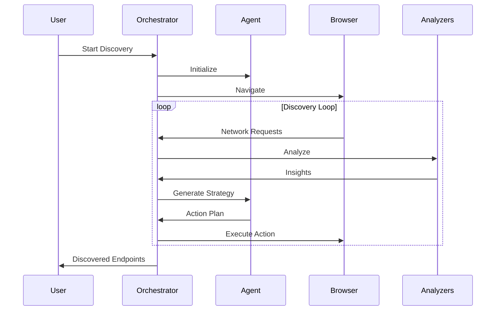

# API Security Testing - Architecture

## System Overview

API Security Testing Skill 是一个高级 API 安全渗透测试系统，采用多层级推理引擎和动态策略决策机制。

## Architecture Diagram

```mermaid
graph TB
    subgraph "Agent Core"
        A["Agent Brain<br/>(LLM Decision Engine)"]
        C["Context Manager<br/>(动态上下文)"]
        L["Learning Engine<br/>(持续学习)"]
    end
    
    subgraph "Collectors (信息收集)"
        B["Browser Collector<br/>(动态交互)"]
        R["Response Analyzer<br/>(响应分析)"]
        S["Source Analyzer<br/>(全资源分析)"]
    end
    
    subgraph "Execution
        I["Insight Generator<br/>(洞察生成)"]
        P["Strategy Generator<br/>(策略生成)"]
        V["Validator<br/>(验证器)"]
    end
    
    A --> C
    A --> P
    A --> I
    
    C --> B
    C --> R
    C --> S
    
    L --> A
    
    B --> R
    R --> S
    S --> I
    I --> A
    
    P --> V
    V --> A
```

## Traditional vs Intelligent Discovery

### Traditional (Hardcoded Regex)

```
JS Code → Regex Match → Endpoints
```

Problems:
- Cannot find dynamically constructed URLs
- Cannot understand environment variable injection
- Cannot analyze conditional branches
- Cannot detect indirect API calls

### Intelligent Discovery (LLM-Driven)

```
JS Code → LLM Understanding → Context Update → Strategy → Action → Observation → Loop
```

Advantages:
- Understands code logic, not just patterns
- Adapts to any framework
- Learns from execution results
- Dynamic strategy generation

## Core Components

### 1. Agent Brain

LLM-powered decision engine that:
- Analyzes observations to generate insights
- Generates discovery strategies based on context
- Decides next actions dynamically
- Learns from execution results

### 2. Context Manager

Maintains and updates discovery context:
- Tracks discovered endpoints with confidence scores
- Records exploration history
- Manages tech stack information
- Handles patterns and relationships

### 3. Browser Collector

Autonomous browser control:
- Navigates to URLs
- Identifies interactive elements
- Monitors network requests
- Executes user interactions

### 4. Source Analyzer

Analyzes all resource types:
- JavaScript code (LLM-driven)
- HTML content
- CSS files
- API responses

### 5. Response Analyzer

Infers endpoints from responses:
- Pagination patterns
- Nested resources
- CRUD operations
- HATEOAS links

## Data Flow



## Key Design Principles

1. **Agent-Centralized**: LLM is the core decision maker
2. **No Hardcoding**: All strategies generated by LLM in real-time
3. **Context-Driven**: Every decision based on current context
4. **Continuous Learning**: Agent updates understanding during execution

## Module Structure

```
scripts/
├── intelligent_discovery/           # New LLM-driven discovery
│   ├── __init__.py
│   ├── models.py                    # Data models
│   ├── agent_brain.py               # Decision engine
│   ├── context_manager.py           # Context management
│   ├── orchestrator.py              # Main coordinator
│   └── collectors/                  # Information collectors
│       ├── browser_collector.py
│       ├── source_analyzer.py
│       └── response_analyzer.py
│
├── orchestrator.py                 # Legacy orchestrator
├── collectors_coordinator.py       # Legacy coordinator
├── reasoning_engine.py             # Multi-level reasoning
├── strategy_pool.py                 # Dynamic strategies
├── testing_loop.py                  # Insight-driven loop
└── ...
```
