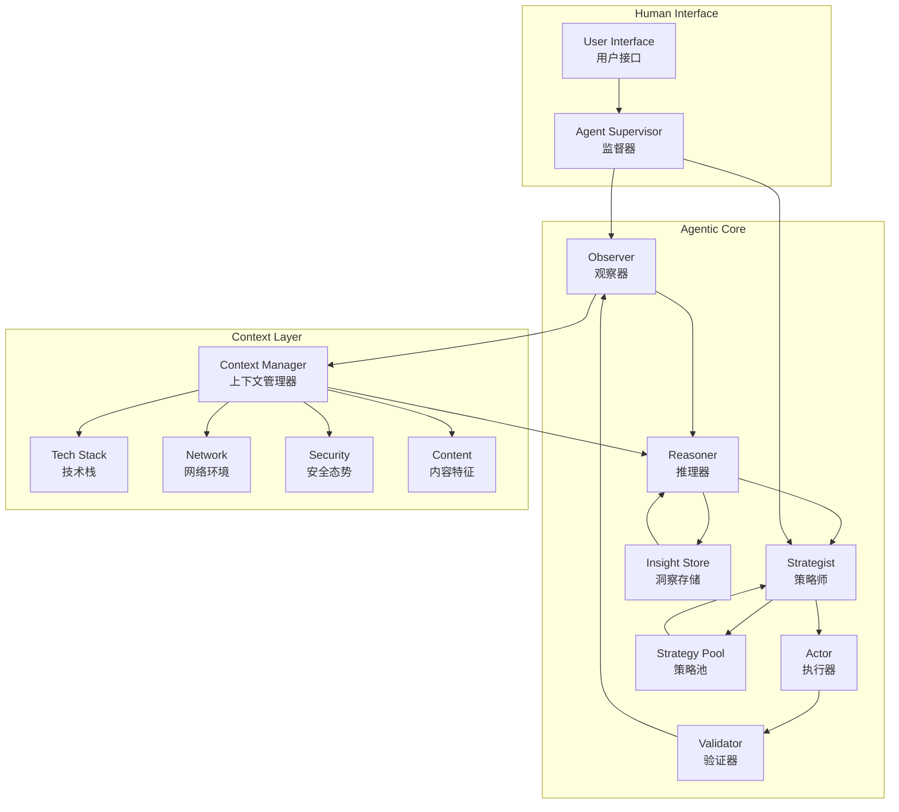
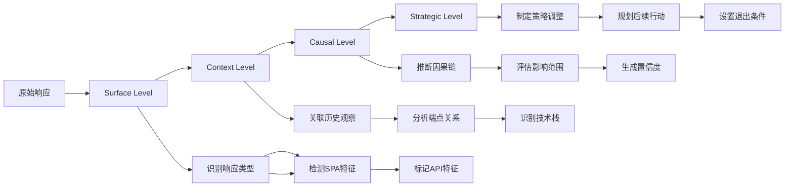
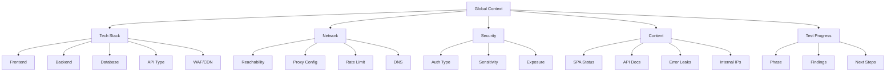
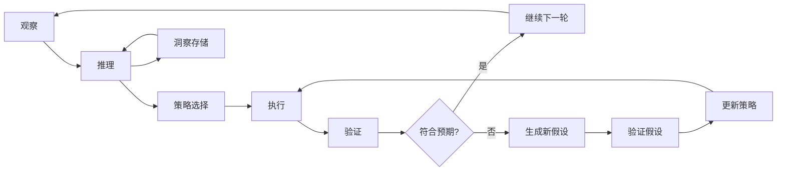

# Agentic Reasoning Enhancement - 技术设计文档

Feature Name: agentic-reasoning-enhancement
Updated: 2026-03-31

## 描述

本设计文档定义了 API 安全测试 Skill 的三大核心增强的技术实现方案：
1. **多层级推理引擎** - 从表面现象到深层因果理解
2. **动态策略调整系统** - 根据上下文自适应测试策略
3. **全维度上下文感知** - 全方位感知测试环境与目标特征

## 架构概览



## 核心组件

### 1. Observer (观察器)

**职责：** 收集原始数据，提取观察特征

**接口：**
```python
class Observer:
    def observe(self, response: Response) -> Observation:
        """
        观察单个响应
        Returns: Observation {
            url: str,
            status_code: int,
            content_type: str,
            content_length: int,
            is_html: bool,
            is_json: bool,
            content_preview: str,
            headers: Dict,
            timing: float,
            spa_indicators: List[str],
            api_indicators: List[str],
            security_indicators: List[str],
            tech_fingerprints: Dict[str, Set[str]]
        }
        """
        
    def observe_batch(self, responses: List[Response]) -> List[Observation]:
        """批量观察"""
        
    def get_observation_summary(self) -> ObservationSummary:
        """获取观察摘要"""
```

### 2. Reasoner (推理器)

**职责：** 从观察到洞察，执行多层级推理

**接口：**
```python
class UnderstandingLevel(Enum):
    SURFACE = "surface"      # 表面现象
    CONTEXT = "context"      # 上下文理解
    CAUSAL = "causal"       # 因果推理
    STRATEGIC = "strategic"  # 战略调整

@dataclass
class Finding:
    what: str           # 观察到什么
    so_what: str        # 这意味着什么
    why: str            # 为什么
    implication: str     # 对测试的影响
    strategy: str        # 调整后的策略
    confidence: float   # 置信度 0-1
    level: UnderstandingLevel
    
@dataclass
class Insight:
    id: str
    type: InsightType   # OBSERVATION, PATTERN, INFERENCE, BLOCKER, OPPORTUNITY
    content: str
    source: str
    confidence: float
    findings: List[Finding]
    action_required: Optional[str]
    generated_at: datetime

class Reasoner:
    def reason(self, observation: Observation, context: Context) -> List[Insight]:
        """
        执行多层级推理
        1. Surface Level: 识别响应类型和基本特征
        2. Context Level: 理解上下文关联
        3. Causal Level: 推断因果关系
        4. Strategic Level: 制定调整策略
        """
        
    def reason_from_pattern(self, observations: List[Observation]) -> Insight:
        """
        从观察模式中推理
        例如：多个路径返回相同大小的 HTML → SPA fallback
        """
        
    def reason_contradiction(self, obs1: Observation, obs2: Observation) -> Insight:
        """
        推理矛盾现象
        例如：请求 JSON 返回 HTML
        """
        
    def estimate_confidence(self, insight: Insight) -> float:
        """
        评估洞察置信度
        基于：证据数量、一致性、历史准确率
        """
```

### 3. Strategist (策略师)

**职责：** 根据洞察动态选择和调整测试策略

**接口：**
```python
@dataclass
class Strategy:
    id: str
    name: str
    priority: int
    conditions: List[Condition]  # 激活条件
    actions: List[Action]         # 执行动作
    exit_criteria: List[Criteria] # 退出条件
    metrics: Dict[str, float]    # 策略有效性指标

class StrategyPool:
    """策略池"""
    
    def __init__(self):
        self.strategies = {
            'default': Strategy(...),
            'waf_detected': Strategy(...),
            'spa_fallback': Strategy(...),
            '内网地址': Strategy(...),
            'high_value_endpoint': Strategy(...),
            'auth_testing': Strategy(...),
            'rate_limited': Strategy(...),
            'sensitive_operation': Strategy(...),
        }
    
    def select_strategy(self, insights: List[Insight], context: Context) -> Strategy:
        """根据洞察选择最佳策略"""
        
    def adapt_strategy(self, strategy: Strategy, feedback: Feedback) -> Strategy:
        """根据反馈调整策略"""
        
    def record_strategy_outcome(self, strategy: Strategy, success: bool):
        """记录策略执行结果"""

class Strategist:
    def create_strategy_plan(self, insights: List[Insight], context: Context) -> StrategyPlan:
        """
        创建策略计划
        Returns: StrategyPlan {
            strategies: List[Strategy],
            execution_order: List[str],
            adaptations: Dict[str, Adaptation],
            fallback_strategy: Strategy
        }
        """
        
    def evaluate_strategy_effectiveness(self, strategy: Strategy, results: TestResults) -> float:
        """评估策略有效性"""
```

### 4. Actor (执行器)

**职责：** 根据策略执行测试动作

**接口：**
```python
class Actor:
    def execute_action(self, action: Action, context: Context) -> ActionResult:
        """执行单个动作"""
        
    def execute_strategy(self, strategy: Strategy, context: Context) -> Generator[ActionResult, None, None]:
        """执行完整策略（生成器模式）"""
        
    def pause_for_confirmation(self, message: str) -> bool:
        """暂停等待用户确认"""
```

### 5. Validator (验证器)

**职责：** 验证测试结果，更新洞察

**接口：**
```python
class Validator:
    def validate_result(self, action: Action, result: ActionResult, expected: Any) -> Validation:
        """
        验证结果是否符合预期
        Returns: Validation {
            is_expected: bool,
            deviation: float,
            new_insights: List[Insight],
            strategy_adjustment: Optional[Adjustment]
        }
        """
        
    def check_convergence(self, insights: List[Insight]) -> bool:
        """检查测试是否收敛"""
        
    def generate_validation_report(self) -> ValidationReport:
        """生成验证报告"""
```

### 6. Context Manager (上下文管理器)

**职责：** 维护和管理全维度上下文

**接口：**
```python
@dataclass
class TechStackContext:
    frontend: Set[str] = field(default_factory=set)   # Vue, React, Angular
    backend: Set[str] = field(default_factory=set)    # Spring, Django, Express
    database: Set[str] = field(default_factory=set)   # MySQL, PostgreSQL, MongoDB
    api_type: Set[str] = field(default_factory=set)  # REST, GraphQL, gRPC
    waf: Optional[str] = None
    cdn: Optional[str] = None
    
@dataclass
class NetworkContext:
    is_reachable: bool = True
    requires_proxy: bool = False
    proxy_config: Optional[ProxyConfig] = None
    rate_limit_status: RateLimitStatus = RateLimitStatus.NORMAL
    blocked_count: int = 0
    dns_resolution: Optional[str] = None
    
@dataclass
class SecurityContext:
    auth_required: bool = False
    auth_type: Optional[str] = None  # JWT, OAuth, Basic, Session
    sensitive_endpoints: Set[str] = field(default_factory=set)
    exposure_level: ExposureLevel = ExposureLevel.NORMAL
    data_classification: DataClassification = DataClassification.INTERNAL
    
@dataclass
class ContentContext:
    is_spa: bool = False
    has_api_docs: bool = False
    swagger_urls: List[str] = field(default_factory=list)
    error_leaks: List[str] = field(default_factory=list)
    base_urls: Set[str] = field(default_factory=set)  # 后端地址
    internal_ips: Set[str] = field(default_factory=set)
    response_pattern: ResponsePattern = ResponsePattern.NORMAL
    
@dataclass
class GlobalContext:
    target_url: str
    start_time: datetime
    current_phase: TestPhase
    tech_stack: TechStackContext
    network: NetworkContext
    security: SecurityContext
    content: ContentContext
    discovered_endpoints: List[Endpoint]
    test_history: List[TestRecord]
    insights: List[Insight]
    user_preferences: Dict[str, Any]
    
class ContextManager:
    def update_tech_stack(self, fingerprints: Dict[str, Set[str]]):
        """更新技术栈上下文"""
        
    def update_network_status(self, reachable: bool, reason: Optional[str]):
        """更新网络状态"""
        
    def mark_internal_address(self, address: str, source: str):
        """标记内网地址"""
        
    def update_rate_limit(self, blocked: bool):
        """更新速率限制状态"""
        
    def add_discovered_endpoint(self, endpoint: Endpoint):
        """添加发现的端点"""
        
    def add_insight(self, insight: Insight):
        """添加洞察"""
        
    def get_relevant_context(self, for_phase: TestPhase) -> Dict:
        """获取相关上下文"""
        
    def export_context(self) -> Dict:
        """导出完整上下文"""
```

## 数据模型

### Observation (观察)

```python
@dataclass
class Observation:
    id: str
    timestamp: datetime
    url: str
    method: str
    request: RequestInfo
    
    # 响应基础
    status_code: int
    content_type: str
    content_length: int
    content_hash: str
    
    # 内容类型
    is_html: bool
    is_json: bool
    is_xml: bool
    is_plain_text: bool
    
    # 特征指标
    spa_indicators: List[str]      # ['webpack_chunk', 'vue_keyword', 'div_id_app']
    api_indicators: List[str]      # ['swagger_keyword', 'paths_keyword', 'api_path']
    security_indicators: List[str] # ['sql_error', 'xss_reflect', 'auth_required']
    tech_fingerprints: Dict[str, Set[str]]
    
    # 上下文
    source: str                    # 'js', 'html', 'api', 'browser', 'fuzz'
    parent_url: Optional[str]
    parameters: Dict[str, str]
    
    # 时序特征
    response_time: float
    is_first_request: bool
    consecutive_failures: int
```

### Insight (洞察)

```python
class InsightType(Enum):
    OBSERVATION = "observation"      # 观察到的事实
    PATTERN = "pattern"              # 发现的模式
    INFERENCE = "inference"          # 推断
    BLOCKER = "blocker"              # 阻碍因素
    OPPORTUNITY = "opportunity"      # 机会
    STRATEGY_CHANGE = "strategy"    # 策略调整
    WARNING = "warning"              # 警告
    VALIDATION = "validation"        # 验证结果

@dataclass
class Insight:
    id: str
    type: InsightType
    content: str
    
    # 推理详情
    observations: List[str]          # 基于哪些观察
    findings: List[Finding]          # 推理发现
    
    # 上下文
    source: str                      # 哪个模块生成
    confidence: float
    
    # 行动指引
    action_required: Optional[str]
    affected_strategies: List[str]
    
    # 元数据
    generated_at: datetime
    valid_until: Optional[datetime]
    is_active: bool = True

@dataclass
class Finding:
    what: str           # 观察到什么
    so_what: str        # 这意味着什么（核心）
    why: str            # 为什么（原因分析）
    implication: str   # 对测试的影响
    strategy: str      # 调整后的策略
    confidence: float
    level: UnderstandingLevel
    evidence: List[str]
```

### Strategy (策略)

```python
@dataclass
class Condition:
    type: str           # 'insight_type', 'tech_stack', 'network_status', etc.
    operator: str       # 'equals', 'contains', 'greater_than', etc.
    value: Any
    
@dataclass
class Action:
    type: str           # 'test_sqli', 'test_xss', 'fuzz_path', etc.
    params: Dict[str, Any]
    priority: int
    timeout: float
    retry_on_failure: int
    
@dataclass
class Strategy:
    id: str
    name: str
    description: str
    
    # 激活条件
    activation_conditions: List[Condition]
    priority: int
    
    # 执行规格
    actions: List[Action]
    execution_order: str  # 'sequential', 'parallel', 'adaptive'
    
    # 退出条件
    exit_on: List[str]    # 'all_complete', 'vuln_found', 'blocked', etc.
    max_duration: float
    max_iterations: int
    
    # 适应性
    is_adaptive: bool
    adaptation_rules: List[AdaptationRule]
    
    # 指标
    success_count: int = 0
    failure_count: int = 0
    avg_effectiveness: float = 0.0
```

## 推理引擎详细设计

### 多层级推理流程



### 推理规则示例

```python
# 规则库
REASONING_RULES = {
    'spa_fallback_detection': {
        'condition': lambda obs: obs.is_html and obs.content_length in [678, 574] and len(set(o.content_length for o in recent_obs)) == 1,
        'finding': Finding(
            what="所有 {count} 个不同路径返回完全相同大小的 HTML ({length} 字节)",
            so_what="这是典型的 SPA (Vue.js/React) fallback 行为",
            why="前端服务器(Nginx)配置了 catch-all 路由，将所有请求都路由到 index.html",
            implication="后端 API 不在当前服务器，可能在内网或使用不同的地址",
            strategy="1. 从 JS 中提取后端 API 地址 2. 尝试不同端口/路径探测 3. 如内网地址需要代理访问",
            confidence=0.95
        )
    },
    
    'json_request_html_response': {
        'condition': lambda obs: '.json' in obs.url and not obs.is_json and obs.is_html,
        'finding': Finding(
            what="请求 JSON 文件 ({url}) 但返回 HTML",
            so_what="该路径在服务端不存在，是前端在模拟",
            why="后端 API 服务器与前端分离，SPA fallback 导致请求被发到前端",
            implication="无法通过前端服务器访问真正的 API 文档",
            strategy="1. 从 JS 或网络请求中识别后端真实地址 2. 直接测试后端地址",
            confidence=0.9
        )
    },
    
    'internal_ip_discovery': {
        'condition': lambda obs: any(re.search(p, obs.content) for p in INTERNAL_IP_PATTERNS),
        'finding': Finding(
            what="从响应中发现内网地址: {ips}",
            so_what="后端 API 在内网环境，前端无法直接访问",
            why="系统采用前后端分离架构，后端部署在内网",
            implication="无法从外部直接测试后端 API",
            strategy="1. 标记内网地址 2. 建议通过代理工具访问 3. 寻找外网暴露的测试环境",
            confidence=0.95
        )
    },
    
    'waf_detection': {
        'condition': lambda obs: any(sig in obs.content for sig in WAF_SIGNATURES),
        'finding': Finding(
            what="检测到 WAF 特征: {waf_type}",
            so_what="目标受 WAF 保护，需要使用绕过技术",
            why="WAF 会拦截明显的攻击尝试",
            implication="标准 payload 可能被拦截",
            strategy="1. 激活 WAF 绕过策略 2. 使用编码和混淆 3. 尝试绕过 WAF 的已知弱点",
            confidence=0.85
        )
    }
}
```

## 策略动态调整详细设计

### 策略切换状态机

```mermaid
stateDiagram-v2
    [*] --> Default
    Default --> WAFDetected: 检测到WAF特征
    WAFDetected --> WAFBypass: 加载绕过payload
    WAFBypass --> Default: WAF未拦截
    WAFBypass --> RateLimited: 请求被封锁
    RateLimited --> SlowMode: 降低速率50%
    SlowMode --> Default: 恢复可用
    Default --> SPADetected: SPA特征
    SPADetected --> DeepRecon: 深入JS分析
    DeepRecon --> Default: 完成
    Default --> HighValueFound: 发现高价值端点
    HighValueFound --> IntensiveTest: 增加测试深度
    IntensiveTest --> Default: 完成
    SPADetected --> InternalIPFound: 发现内网地址
    InternalIPFound --> ProxyMode: 提示配置代理
    ProxyMode --> [*]
```

### 策略池定义

```python
STRATEGY_POOL = {
    'default': {
        'name': '默认测试策略',
        'priority': 0,
        'conditions': [],
        'actions': ['discover_endpoints', 'test_sqli', 'test_xss', 'test_auth'],
        'rate_limit': 10,
        'payload_set': 'standard'
    },
    
    'waf_detected': {
        'name': 'WAF 绕过策略',
        'priority': 10,
        'conditions': [{'type': 'insight', 'value': 'waf_detected'}],
        'actions': ['test_sqli_bypass', 'test_xss_bypass', 'test_obfuscated'],
        'rate_limit': 2,
        'payload_set': 'waf_bypass'
    },
    
    'spa_fallback': {
        'name': 'SPA 深度分析策略',
        'priority': 20,
        'conditions': [{'type': 'insight', 'value': 'spa_fallback'}],
        'actions': ['extract_js', 'analyze_webpack', 'find_api_urls', 'test_from_js'],
        'rate_limit': 5,
        'focus': 'reconnaissance'
    },
    
    'internal_address': {
        'name': '内网代理策略',
        'priority': 30,
        'conditions': [{'type': 'insight', 'value': 'internal_ip_found'}],
        'actions': ['mark_unreachable', 'extract_testable_apis', 'suggest_proxy'],
        'rate_limit': 0,
        'requires_user_action': True
    },
    
    'high_value_endpoint': {
        'name': '高价值端点深度测试',
        'priority': 15,
        'conditions': [{'type': 'endpoint_score', 'operator': 'greater_than', 'value': 8}],
        'actions': ['full_test_suite', 'test_edge_cases', 'bypass_auth'],
        'rate_limit': 5,
        'depth': 'maximum'
    },
    
    'auth_testing': {
        'name': '认证安全专项',
        'priority': 25,
        'conditions': [{'type': 'endpoint_type', 'value': 'auth'}],
        'actions': ['test_default_creds', 'test_bypass', 'test_jwt', 'test_session'],
        'rate_limit': 3,
        'safety_mode': True
    },
    
    'rate_limited': {
        'name': '限速自适应策略',
        'priority': 40,
        'conditions': [{'type': 'network_status', 'value': 'rate_limited'}],
        'actions': ['reduce_rate', 'rotate_user_agent', 'use_proxy'],
        'rate_limit': 1,
        'cooldown': 60
    },
    
    'sensitive_operation': {
        'name': '敏感操作安全策略',
        'priority': 35,
        'conditions': [{'type': 'endpoint_type', 'value': 'sensitive'}],
        'actions': ['minimal_testing', 'simulate_normal_usage', 'avoid_destructive'] ,
        'rate_limit': 1,
        'safety_mode': True
    }
}
```

## 上下文感知详细设计

### 上下文维度



### 上下文自动更新规则

```python
CONTEXT_UPDATE_RULES = {
    'tech_stack': {
        'vue': {'source': 'js_fingerprint', 'confidence': 0.9, 'actions': ['enable_vue_specific_tests']},
        'react': {'source': 'js_fingerprint', 'confidence': 0.9, 'actions': ['enable_react_specific_tests']},
        'spring': {'source': 'header_fingerprint', 'confidence': 0.85, 'actions': ['enable_java_specific_tests']},
        'django': {'source': 'cookie_fingerprint', 'confidence': 0.8, 'actions': ['enable_python_specific_tests']},
    },
    
    'network_status': {
        'rate_limited': {
            'threshold': 3,
            'actions': ['switch_to_slow_mode', 'rotate_user_agent', 'use_proxy_pool']
        },
        'blocked': {
            'threshold': 5,
            'actions': ['pause_testing', 'notify_user', 'suggest_proxy']
        }
    },
    
    'sensitivity': {
        'auth_endpoint': {
            'indicators': ['/login', '/signin', '/auth', '/password'],
            'actions': ['enable_safe_mode', 'reduce_rate', 'avoid_lockout']
        },
        'payment_endpoint': {
            'indicators': ['/pay', '/checkout', '/order', '/purchase'],
            'actions': ['enable_safe_mode', 'minimal_testing', 'simulate_only']
        }
    }
}
```

## 洞察驱动测试循环



## 正确性属性

1. **推理完整性** - 所有观察最终都会生成洞察（即使是否定洞察）
2. **策略一致性** - 相同上下文中总是选择相同策略
3. **上下文一致性** - 所有组件共享同一全局上下文
4. **可追溯性** - 每个洞察都可以追溯到原始观察
5. **置信度有效性** - 置信度值反映真实准确率

## 错误处理

| 场景 | 处理策略 |
|------|---------|
| 推理超时 | 使用默认推断，标记为"待验证" |
| 策略选择失败 | 回退到默认策略 |
| 上下文更新失败 | 保留旧上下文，继续测试 |
| 用户无响应 | 超时后继续执行，使用安全默认值 |
| 网络错误 | 降级到离线模式，减少依赖 |

## 测试策略

### 单元测试

1. **推理引擎测试**
   - 测试每个推理规则是否正确触发
   - 测试置信度计算是否准确
   - 测试矛盾检测是否有效

2. **策略系统测试**
   - 测试策略选择逻辑
   - 测试策略切换是否正确
   - 测试策略有效性评估

3. **上下文管理测试**
   - 测试上下文更新逻辑
   - 测试上下文一致性
   - 测试上下文导出

### 集成测试

1. **端到端测试**
   - 测试完整的"观察-推理-策略-执行"循环
   - 测试多种场景组合

2. **性能测试**
   - 测试推理响应时间 < 5 秒
   - 测试上下文更新延迟 < 100ms

### 回归测试

1. 确保现有功能不受影响
2. 确保现有 payload 库仍然可用
3. 确保报告格式兼容

## 参考实现

- `core/agentic_analyzer.py` - 现有推理分析器
- `core/orchestrator.py` - 现有编排器
- `core/scan_engine.py` - 扫描引擎架构参考
- `core/advanced_recon.py` - 高级侦察模块

## 依赖项

- Python 3.8+
- requests
- dataclasses (Python 3.7+)
- enum (Python 3.4+)
