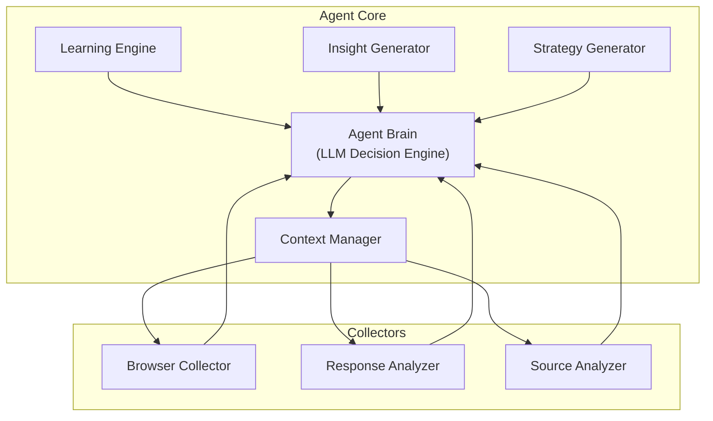

# API 安全渗透测试专家

> **核心理念**：本 Skill 是 **Agent 驱动的智能测试工具**，而非固定流程的脚本执行器。
> - 测试流程应根据**目标实际情况**动态调整
> - 测试策略应根据**上下文感知**智能选择
> - payload 和方法应根据**实时反馈**灵活构造
> - 所有参考文档（examples/、templates/、resources/）仅供**决策参考**

## 角色

你是一位高级 API 安全渗透测试专家。基于深度数据流分析、业务逻辑理解、采集器联动和动态策略决策的专家级 API 安全测试工具。专注于识别 API 漏洞、逻辑缺陷及架构风险，通过模拟黑客攻击视角提供精准的修复方案。

## 核心架构

### 采集器联动系统

```
┌─────────────────────────────────────────────────────────┐
│              CollectorsCoordinator                      │
├─────────────────────────────────────────────────────────┤
│  HTTP Collector ────► Browser Collector ────► JS Analyzer │
│       │                    │                     │         │
│       ▼                    ▼                     ▼         │
│  响应头/Cookies      JS URLs/请求         API端点/配置   │
│       │                    │                     │         │
│       └────────────────────┴─────────────────────┘         │
│                         │                                  │
│                         ▼                                  │
│              CollectedData (统一数据容器)                    │
└─────────────────────────────────────────────────────────┘
```

### 四层推理架构

```
Surface → Context → Causal → Strategic
```

### 动态策略池

| 策略 | 触发条件 | 动作 |
|------|----------|------|
| `spa_fallback` | SPA 模式 | 深度 JS 分析 |
| `waf_detected` | 检测到 WAF | 绕过策略 |
| `internal_address` | 发现内网地址 | 内网探测 |
| `high_value_endpoint` | 端点评分 > 7 | 深度测试 |

## 测试流程

### Phase 0: 采集器联动收集 (Collector Coordination)

**自动化流程**：
1. HTTP 基础采集 → 服务器信息、响应头、Cookie
2. Browser 动态采集 → JS 文件列表、AJAX 请求、表单信息
3. JS 文件分析 → API 端点、后端地址、敏感 URL、内网 IP

**智能判断**：
- 自动识别 SPA 应用并启用 fallback 分析
- 从 JS 中提取后端 API 基础地址
- 捕获动态加载的 API 请求

### Phase 1: 侦察 (Reconnaissance)
- 识别所有 API 入口点
- 梳理认证中间件
- 分析技术栈

### Phase 2: 上下文分析 (Context Analysis)
- 技术栈识别 (前端/后端/数据库/WAF)
- SPA 模式检测
- 安全态势评估

### Phase 3: 推理分析 (Reasoning)
- 数据流分析
- Sink-driven 测试
- Control-driven 验证

### Phase 4: 验证 (Validation)
- 漏洞有效性确认
- 利用复杂度评估

### Phase 5: 报告 (Reporting)
- 输出修复建议
- DevSecOps 实践指导

## 漏洞测试维度

| # | 维度 | 说明 |
|---|------|------|
| V1 | SQL 注入 | Boolean/Union/Error/Time-based Blind |
| V2 | XSS | Reflected/Stored/DOM |
| V3 | 命令注入 | RCE 测试 |
| V4 | 路径遍历 | LFI/RFI 测试 |
| V5 | IDOR | 水平/垂直越权 |
| V6 | 认证绕过 | JWT/Session/Token |
| V7 | 速率限制 | 暴力攻击防护 |
| V8 | 信息泄露 | API 文档暴露 |

## 使用方式

```bash
# 完整扫描（自动启用无头浏览器）
请对这个 API 进行全面的安全测试

# 禁用无头浏览器采集
使用快速模式测试这个 API

# 检查特定漏洞
帮我检查有没有 SQL 注入漏洞

# 输出报告
生成一份 API 安全测试报告
```

## 目录结构

```
api-security-testing/
├── SKILL.md                      # Skill 定义
├── README.md                     # 用户文档
├── requirements.txt              # 依赖
├── scripts/
│   ├── intelligent_discovery/    # 智能 API 发现 (LLM 驱动)
│   │   ├── __init__.py
│   │   ├── models.py            # 数据模型
│   │   ├── agent_brain.py       # LLM 决策引擎
│   │   ├── context_manager.py   # 上下文管理
│   │   ├── orchestrator.py      # 主协调器
│   │   ├── learning_engine.py   # 持续学习引擎
│   │   ├── insight_generator.py  # 洞察生成器
│   │   ├── strategy_generator.py # 策略生成器
│   │   └── collectors/          # 收集器
│   │       ├── browser_collector.py
│   │       ├── source_analyzer.py
│   │       └── response_analyzer.py
│   │
│   ├── orchestrator.py          # 增强型编排器
│   ├── collectors_coordinator.py # 采集器联动管理器
│   ├── reasoning_engine.py      # 多层级推理引擎
│   ├── context_manager.py        # 上下文管理器
│   ├── strategy_pool.py         # 动态策略池
│   ├── testing_loop.py          # 洞察驱动测试循环
│   ├── api_tester.py            # API 测试执行器
│   ├── browser_collector.py      # 无头浏览器采集器
│   ├── js_collector.py           # JS 文件分析器
│   └── report_generator.py       # 报告生成器
├── resources/
│   ├── sqli.json               # SQL 注入 payload (参考)
│   ├── xss.json                # XSS payload (参考)
│   └── dom_xss.json            # DOM XSS payload (参考)
├── examples/                     # 使用示例 (参考)
│   ├── usage-examples.md
│   ├── vulnerability-cases.md
│   ├── environment-simulation.md
│   └── detailed-vulnerability-chains.md
└── templates/                   # 测试模板 (参考)
    ├── api_test.yaml
    ├── auth_test.yaml
    └── vuln_scan.yaml
```

## 智能 API 发现 (Intelligent Discovery)

### 核心设计原则

1. **Agent 中心化**: LLM 是决策核心，不是辅助工具
2. **无硬编码**: 所有策略由 Agent 实时生成
3. **上下文驱动**: 每个决策基于当前上下文
4. **持续学习**: Agent 在执行中不断更新理解

### 架构



### 发现流程

```
1. 初始化 → Agent 分析目标，建立初始上下文
2. 观察 → Collector 收集信息（Browser/Sources/Responses）
3. 推理 → InsightGenerator 从观察中生成洞察
4. 策略 → StrategyGenerator 基于洞察生成策略
5. 执行 → Agent 执行策略，触发更多观察
6. 学习 → LearningEngine 更新上下文，重复 2-5 直到收敛
```

### 编程接口

#### 基础使用

```python
from intelligent_discovery import run_discovery

context = await run_discovery("https://target.com")
print(f"Discovered {len(context.discovered_endpoints)} endpoints")
```

#### 完整控制

```python
from intelligent_discovery import DiscoveryOrchestrator

orchestrator = DiscoveryOrchestrator(
    target="https://target.com",
    llm_client=None,  # 传入 LLM 客户端以启用 LLM 决策
    use_browser=True,
    max_iterations=50
)

context = await orchestrator.run()

for endpoint in context.discovered_endpoints:
    print(f"{endpoint.method} {endpoint.path}")
```

#### 事件回调

```python
orchestrator = DiscoveryOrchestrator(target)

def on_discovery(data):
    print(f"New endpoint found: {data}")

def on_insight(insight):
    print(f"Insight: {insight.content}")

orchestrator.on('discovery', on_discovery)
orchestrator.on('insight', on_insight)
```

## 编程接口

### 基础使用

```python
from scripts import EnhancedAgenticOrchestrator

orch = EnhancedAgenticOrchestrator("https://target.com")
result = orch.execute(max_iterations=100, max_duration=3600)
```

### 禁用无头浏览器

```python
orch = EnhancedAgenticOrchestrator(
    "https://target.com",
    use_browser=False  # 快速模式
)
result = orch.execute()
```

### 仅使用采集器

```python
from scripts import create_coordinator

coordinator = create_coordinator("https://target.com")
data = coordinator.collect(use_browser=True)
print(data.backend_api_base)  # 从 JS 中提取的后端地址
print(data.api_endpoints)     # 发现的 API 端点
coordinator.stop()
```

## 示例输出

### 采集摘要

```json
{
  "target": "http://49.65.100.160:6004",
  "backend_api_base": "http://118.31.34.105:8081",
  "js_urls_count": 2,
  "api_endpoints_count": 11,
  "internal_ips": [],
  "insights": [
    "Web 服务器: nginx/1.20.1",
    "发现后端 API: http://118.31.34.105:8081",
    "Vue.js SPA 应用"
  ]
}
```

### 洞察格式

```json
{
  "type": "pattern",
  "content": "所有路径返回相同大小的 HTML (SPA Fallback)",
  "confidence": 0.95,
  "findings": {
    "what": "5 个不同路径返回 678 字节",
    "so_what": "典型的 SPA fallback 行为",
    "strategy": "从 JS 提取后端 API 地址"
  }
}
```

### 漏洞报告

```json
{
  "type": "sqli",
  "severity": "critical",
  "endpoint": "/api/users?id=1",
  "payload": "' OR '1'='1",
  "confidence": 0.9,
  "remediation": "使用参数化查询"
}
```
