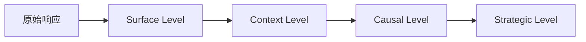
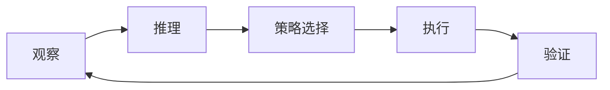

# Payloader Skill - 渗透测试辅助平台 v3.0

## 概述

本 skill 提供**由 Agent 驱动的自动化接口渗透测试**能力，不仅仅是脚本执行，而是具备理解、推理、决策能力的智能系统。

核心组件：
- **ReasoningEngine** - 多层级推理引擎
- **ContextManager** - 全维度上下文管理器
- **StrategyPool** - 动态策略池系统
- **InsightDrivenLoop** - 洞察驱动测试循环

## v3.0 核心增强: Agentic Reasoning

### 核心理念转变

| 传统方式 | Agentic 方式 |
|---------|-------------|
| 脚本执行 | 理解驱动的智能执行 |
| 固定流程 | 动态策略调整 |
| 被动扫描 | 主动发现和推理 |
| 结果输出 | 洞察驱动的闭环学习 |

### 智能推理引擎 (ReasoningEngine)

多层级推理流程：



**8 种推理规则：**
- `internal_ip_discovery` - 内网地址发现 (priority: 110)
- `waf_detection` - WAF 检测 (priority: 105)
- `spa_fallback_detection` - SPA Fallback 检测 (priority: 100)
- `json_request_html_response` - 响应矛盾检测 (priority: 90)
- `swagger_discovery` - API 文档发现 (priority: 80)
- `error_leak_detection` - 错误信息泄露 (priority: 70)
- `auth_detection` - 认证机制检测 (priority: 60)
- `tech_fingerprint` - 技术栈指纹 (priority: 50)

**四段式洞察输出：**
```python
Finding(
    what="所有 5 个不同路径返回完全相同大小的 HTML (678 字节)",
    so_what="这是典型的 SPA fallback 行为",
    why="前端服务器配置了 catch-all 路由",
    implication="后端 API 不在当前服务器，可能在内网",
    strategy="1. 从 JS 中提取后端地址 2. 尝试不同端口探测",
    confidence=0.95
)
```

### 上下文管理器 (ContextManager)

**5 大维度：**
- **TechStackContext** - 技术栈 (前端/后端/数据库/WAF)
- **NetworkContext** - 网络环境 (可达性/代理/限速)
- **SecurityContext** - 安全态势 (认证/敏感度/暴露等级)
- **ContentContext** - 内容特征 (SPA/API文档/错误泄露)
- **TestProgress** - 测试进度 (阶段/发现/下一步)

### 动态策略池 (StrategyPool)

**8 种预定义策略：**
| 策略 ID | 名称 | 优先级 | 激活条件 |
|---------|------|--------|---------|
| default | 默认测试策略 | 0 | 无 |
| waf_detected | WAF 绕过策略 | 10 | 检测到 WAF |
| spa_fallback | SPA 深度分析 | 20 | SPA 模式 |
| internal_address | 内网代理策略 | 30 | 发现内网地址 |
| high_value_endpoint | 高价值端点深度测试 | 15 | 端点评分 > 7 |
| auth_testing | 认证安全专项 | 25 | 认证端点 |
| rate_limited | 限速自适应策略 | 40 | 被限速 |
| sensitive_operation | 敏感操作安全策略 | 35 | 敏感操作 |

### 洞察驱动测试循环 (InsightDrivenLoop)

闭环流程：


**验证器功能：**
- 预期对比验证
- 偏差计算
- 假阴性风险评估
- 收敛检测

## 快速开始

### 基本用法
```bash
# 使用增强型 Agentic Orchestrator
skill security-testing agentic --target https://target.com

# 运行完整扫描
skill security-testing scan --target https://target.com --type full

# DOM XSS 测试
skill security-testing domxss --target https://target.com --browser
```

### 编程接口
```python
from core.orchestrator import EnhancedAgenticOrchestrator

orch = EnhancedAgenticOrchestrator("https://target.com")
result = orch.execute(
    max_iterations=100,
    max_duration=3600.0
)

# 获取洞察
insights = orch.get_insights()

# 获取上下文
context = orch.get_context()
```

## 核心能力

| 能力 | 说明 | 组件 |
|------|------|------|
| 多层级推理 | Surface→Context→Causal→Strategic | ReasoningEngine |
| 规则引擎 | 8+ 可扩展推理规则 | ReasoningEngine |
| 上下文感知 | 5 维度全感知 | ContextManager |
| 动态策略 | 8 种策略自动切换 | StrategyPool |
| 闭环测试 | 观察→推理→策略→执行→验证 | TestingLoop |
| 人机交互 | 暂停确认、推理解释 | All Components |

## 目录结构

```
security-testing/
├── SKILL.md                          # 本文件
├── core/
│   ├── orchestrator.py              # 增强型编排器 (v3.0)
│   ├── reasoning_engine.py          # 推理引擎 (NEW)
│   ├── context_manager.py          # 上下文管理器 (NEW)
│   ├── strategy_pool.py           # 策略池系统 (NEW)
│   ├── testing_loop.py             # 洞察驱动循环 (NEW)
│   ├── api_tester.py              # API 测试引擎
│   ├── browser_tester.py            # 浏览器动态测试引擎
│   └── collectors/                   # 信息采集器
├── payloads/
│   ├── sqli.json                   # SQL 注入 (25+ payload)
│   ├── xss.json                    # XSS (25+ payload)
│   ├── dom_xss.json                # DOM XSS (20 payload)
│   └── auth.json                   # 认证测试
└── workflows/
    └── api_test.yaml               # API 测试流程
```

## API 参考

### ReasoningEngine

```python
from core.reasoning_engine import create_reasoner

reasoner = create_reasoner()

# 观察并推理
response_data = {
    'url': 'https://target.com/api',
    'method': 'GET',
    'status_code': 200,
    'content_type': 'text/html',
    'content': '<!DOCTYPE html>...',
    'source': 'recon'
}

insights = reasoner.observe_and_reason(response_data)

# 获取活跃洞察
active_insights = reasoner.insight_store.get_active()

# 推理规则
for rule in reasoner.rules:
    print(f"{rule.name}: {rule.level.value}")
```

### ContextManager

```python
from core.context_manager import create_context_manager, TestPhase

cm = create_context_manager("https://target.com")

# 更新技术栈
cm.update_tech_stack({'frontend': {'vue'}, 'backend': {'spring'}})

# 设置 SPA 模式
cm.set_spa_mode(True, fallback_size=678)

# 标记内网地址
cm.mark_internal_address("10.0.0.1", source="js_analysis")

# 获取上下文摘要
summary = cm.get_summary()

# 保存/恢复
cm.save_to_file("context.json")
```

### StrategyPool

```python
from core.strategy_pool import create_strategy_pool, StrategyContext

pool = create_strategy_pool()

# 创建策略上下文
context = StrategyContext({
    'is_spa': True,
    'waf_detected': 'aliyun',
    'network_status': 'normal',
    'endpoint_score': 8,
    'insight_types': ['spa_fallback', 'waf_detected']
})

# 选择策略
strategy = pool.select_strategy(context)

# 获取摘要
summary = pool.get_summary()
```

### InsightDrivenLoop

```python
from core.testing_loop import create_test_loop, TestAction

loop = create_test_loop(reasoner, strategist, context_manager)

# 添加测试动作
loop.add_action(TestAction(
    id='test_1',
    type='GET',
    target='https://target.com/api',
    priority=10,
    expected_outcome='2xx'
))

# 运行循环
report = loop.run(max_iterations=100)

# 获取进度
progress = loop.get_progress()
```

## 使用示例

### 示例 1: Agentic 扫描

```python
from core.orchestrator import run_enhanced_agentic_test

result = run_enhanced_agentic_test(
    target="https://target.com",
    max_iterations=100,
    max_duration=3600.0
)

print(f"状态: {result['state']}")
print(f"洞察数: {len(result['insights'])}")
print(f"阻碍因素: {len(result['blockers'])}")
```

### 示例 2: 自定义推理

```python
from core.reasoning_engine import Reasoner, InsightType

reasoner = Reasoner()

# 添加自定义规则
def my_condition(obs, history):
    return 'sensitive' in obs.url.lower()

def my_finding_builder(obs, history):
    from core.reasoning_engine import Finding, UnderstandingLevel
    return Finding(
        what=f"访问敏感路径: {obs.url}",
        so_what="发现敏感 API 端点",
        why="路径包含敏感关键字",
        implication="需要详细测试",
        strategy="启用敏感操作安全策略",
        confidence=0.9,
        level=UnderstandingLevel.STRATEGIC
    )

reasoner.register_rule(ReasoningRule(
    name="sensitive_endpoint",
    description="敏感端点检测",
    level=UnderstandingLevel.STRATEGIC,
    condition=my_condition,
    findings_builder=my_finding_builder,
    priority=120
))
```

### 示例 3: 策略调优

```python
from core.strategy_pool import StrategyPool

pool = StrategyPool()

# 调整策略优先级
strategy = pool.get_strategy('waf_detected')
strategy.priority = 25  # 提高优先级

# 记录策略效果
pool.record_outcome('waf_detected', success=True, effectiveness=0.8)
```

## 洞察类型

| 类型 | 说明 | 示例 |
|------|------|------|
| OBSERVATION | 观察到的事实 | 检测到 WAF 特征 |
| PATTERN | 发现的模式 | SPA fallback 行为 |
| INFERENCE | 推断 | 前后端分离架构 |
| BLOCKER | 阻碍因素 | 后端不可达 |
| OPPORTUNITY | 机会 | 发现 API 文档 |
| STRATEGY_CHANGE | 策略调整 | 切换到 WAF 绕过模式 |

## 配置选项

```yaml
# config.yaml
agentic:
  enabled: true
  max_iterations: 100
  max_duration: 3600
  convergence_threshold: 0.8
  
reasoning:
  rules:
    - spa_fallback_detection
    - waf_detection
    - internal_ip_discovery
    
context:
  tech_stack_detection: true
  network_monitoring: true
  security_analysis: true
  
strategy:
  auto_switch: true
  waf_bypass_enabled: true
  rate_limit_adaptation: true
```

## 更新日志

### v3.0 (2026-03-31)
- ✅ Agentic Reasoning Engine - 多层级推理引擎
- ✅ Context Manager - 全维度上下文感知
- ✅ Strategy Pool - 8 种动态策略
- ✅ Insight-Driven Loop - 闭环测试循环
- ✅ Enhanced Orchestrator - 集成所有组件

### v2.0 (2026-03-30)
- ✅ 自动化测试引擎
- ✅ 智能决策系统
- ✅ 结构化 payload 库 (50+)
- ✅ WAF 检测与绕过
- ✅ 报告生成器
- ✅ 并行测试支持

### v1.0 (原始版本)
- 基础 payload 知识库
- 攻击链模板
- 内网渗透指南

---

*Skill 版本：v3.0*
*更新时间：2026-03-31*
*维护者：Security Team*
*GitHub: https://github.com/steveopen1/skill-play*
