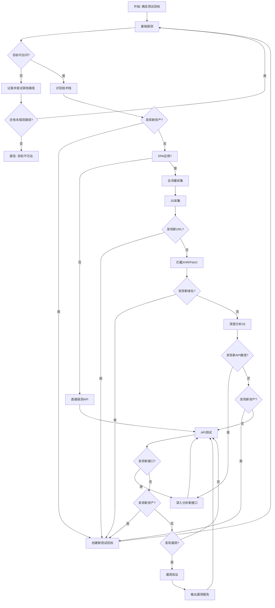

# 完整扫描流程

## 场景化扫描流程

**【强制】所有扫描深度都必须使用Playwright进行JS动态采集，禁止降级**

```
【quick_scan】5分钟快速扫描
├─ 目标：快速发现明显漏洞
└─ 流程：
   ├─ HTTP/HTTPS探测 + 技术栈识别
   ├─ Playwright全流量采集（必须）
   ├─ 关键路径探测
   └─ 快速漏洞测试

【normal_scan】20分钟标准扫描
├─ 目标：全面发现漏洞
└─ 流程：
   ├─ 所有基础探测
   ├─ Playwright全流量采集（必须）
   ├─ JS深度分析
   ├─ 关键端点测试
   └─ 漏洞验证 + 报告输出

【deep_scan】1小时深度扫描
├─ 目标：完整渗透测试
└─ 流程：
   ├─ Playwright全流量采集（必须）
   ├─ JS深度分析(AST+正则+路径推断)
   ├─ 全量API端点测试
   ├─ 认证绕过测试矩阵
   ├─ SQL注入深入利用(判断类型+可利用性)
   ├─ 漏洞链构造
   └─ 完整报告输出
```

## SPA应用完整采集流程

### 流程图（循环迭代模型）



**核心原则**：渗透测试是**循环迭代**过程，不是线性流程！

## 阶段1：基础探测

```
1. HTTP探测目标可访问性
   curl -I http://target.com
   
2. 技术栈识别
   - 检查响应头Server字段
   - 检查HTML中是否包含Vue/React/Angular关键词
   - 检查是否包含webpack chunk引用
   
3. 判断是否是SPA应用
   - /api/* 返回HTML → SPA
   - HTML包含JS chunk路径 → Vue/React应用

4. 全流量监听
   - 捕获所有出站请求（不只是JS）
   - 记录所有第三方域名（CDN、分析服务等）
   - 记录所有静态资源加载
```

## 阶段2：JS采集【强制·禁止降级】

**【禁止降级采集阶段】必须使用Playwright，不允许降级到Selenium/requests**

**【允许】分析阶段可使用curl进行补充**

```
【核心目标】捕获所有流量，不只分析JS文件！

1. Playwright全流量采集（必须）
   - 使用ignore_https_errors=True处理证书问题
   - 拦截所有请求/响应
   - 记录流量类型（xhr/fetch/document/script/websocket）

2. 模拟用户操作（必须）
   - 点击页面触发加载
   - 滚动触发懒加载
   - 填写登录表单
   - 导航到其他页面

3. 多目标队列管理
   TEST_QUEUE = []  # 待测试目标
   TESTED = set()   # 已测试目标
```

## 阶段3：JS深度分析

```
1. 提取baseURL配置（最优先！）
   - r'baseURL\s*[:=]\s*["\']([^"\']+)["\']'
   - r'VUE_APP_\w+["\s]*[:=]["\s]*["\']([^"\']*)["\']'

2. API端点提取
   - r'["\'](/(?:user|auth|admin|login|logout|api|v\d)[^"\']*)["\']'
   - r'axios\.[a-z]+\(["\']([^"\']+)["\']'
   - r'fetch\(["\']([^"\']+)["\']'

3. 敏感信息提取
   - IP地址、内网地址
   - Token、API Key
   - 外部域名
```

## 阶段4：API测试

```
base_path获取优先级:
1. 配置文件: /{app}/_app.config.js 中的 VITE_GLOB_API_URL
2. baseURL配置
3. Swagger/OpenAPI文档
4. nginx反向代理推测
5. JS路径反推
6. 多API共同前缀
7. 字典fallback

【重要】多base_path场景：
- 一个站点可能存在多个base_path
- 需要分别测试每个base_path下的端点
```

## 阶段5：漏洞验证

```
【多维度误报判断框架】

判断逻辑优先级：
1. 先看响应内容是否符合漏洞特征
2. 再看是否为预期响应
3. 最后验证利用可能性

必须先分析"正常响应应该是什么样的"
```

## 阶段6：报告输出

```
1. 收集测试结果
   - 汇总所有发现的漏洞（高/中/低危）
   - 整理API端点清单
   - 记录安全优点

2. 利用链分析
   - 分析独立漏洞的关联性
   - 构建完整攻击链

3. 修复建议
   - 按优先级排序
   - 提供具体修复方案
```
