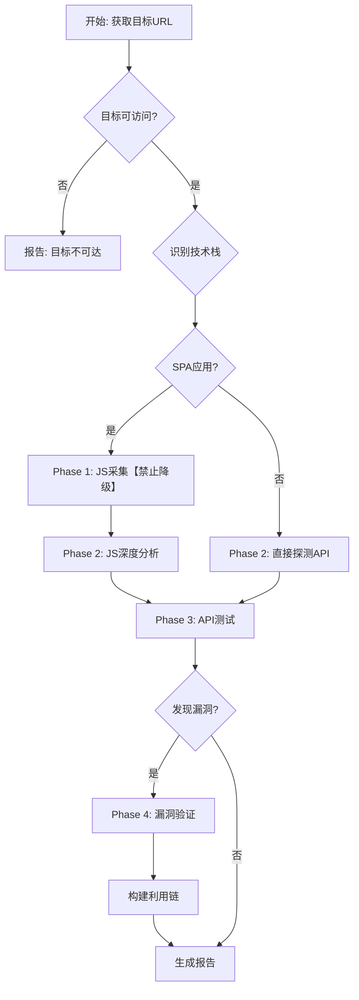

# API Security Testing - API 安全测试

## 核心能力

1. **Playwright JS 动态采集** - 无头浏览器执行，XHR/Fetch 拦截
2. **API 端点智能发现** - JS 解析、URL 模式识别
3. **漏洞检测** - SQLi、XSS、IDOR、敏感数据、安全头部
4. **赛博监工** - 自动监测，压力升级 (L1-L4)

## 测试流程

```
Phase 1: JS 动态采集
    ↓
Phase 2: API 端点发现
    ↓
Phase 3: 漏洞检测
    ↓
Phase 4: 利用链构造
    ↓
Phase 5: 自动报告生成
```

## 决策树



## 执行命令

| 命令 | 说明 |
|------|------|
| `/api-security-testing-scan` | 完整扫描 |
| `/api-security-testing-test` | 快速测试 |
| `/api-security-testing-hook` | 赛博监工控制 |
| `/api-security-testing-status` | 查看状态 |

## 漏洞测试参考

使用 `@` 语法引用漏洞测试指南：

```
@skills/api-security-testing/references/vulnerabilities/README.md
@skills/api-security-testing/references/rest-guidance.md
@skills/api-security-testing/references/graphql-guidance.md
```

### 漏洞类别

| 类别 | 参考文件 |
|------|----------|
| SQL 注入 | `references/vulnerabilities/01-sqli-tests.md` |
| 用户枚举 | `references/vulnerabilities/02-user-enum-tests.md` |
| JWT 安全 | `references/vulnerabilities/03-jwt-tests.md` |
| IDOR | `references/vulnerabilities/04-idor-tests.md` |
| 敏感数据 | `references/vulnerabilities/05-sensitive-data-tests.md` |
| 业务逻辑 | `references/vulnerabilities/06-biz-logic-tests.md` |
| 安全配置 | `references/vulnerabilities/07-security-config-tests.md` |
| 暴力破解 | `references/vulnerabilities/08-brute-force-tests.md` |
| GraphQL | `references/vulnerabilities/11-graphql-tests.md` |

## 赛博监工

**自动激活**，当执行扫描命令时自动开启监督。

| 失败次数 | 等级 | 动作 |
|---------|------|------|
| 2次 | L1 | 切换方法 |
| 3次 | L2 | 深度分析 |
| 5次 | L3 | 7点检查清单 |
| 7次+ | L4 | 绝望模式 |

## 漏洞验证标准

| 严重程度 | 漏洞类型 | 验证方式 |
|----------|----------|----------|
| HIGH | SQL 注入 | 布尔盲注/时间盲注确认 |
| HIGH | 未授权访问 | 访问控制绕过测试 |
| MEDIUM | XSS | 反射/存储型确认 |
| MEDIUM | 敏感数据暴露 | 数据脱敏检查 |
| LOW | 安全头部缺失 | HTTP 头部分析 |

## 输出格式

自动生成 Markdown 格式测试报告，包含：
- 测试目标信息
- 发现的端点列表
- 漏洞详情（严重程度、位置、验证步骤）
- 利用链说明
- 修复建议

## 使用 Python 测试引擎

如需使用独立的 Python 测试引擎：

```bash
cd skills/api-security-testing/tools
python3 core/deep_api_tester_v55.py https://target.com output.md
```

## 重要

- 仅用于合法授权的安全测试
- 测试前确保有书面授权
