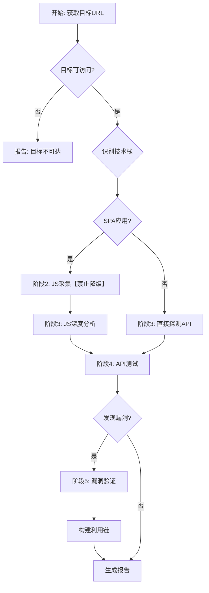

## 完整调度流程

### 决策树



## 执行流程

```
阶段1: 基础探测
  ├─ HTTP/HTTPS探测
  ├─ 技术栈识别
  └─ SPA判断

阶段2: JS采集【禁止降级】
  ├─ Playwright启动
  ├─ XHR/Fetch拦截
  └─ 用户交互触发

阶段3: JS深度分析
  ├─ baseURL提取
  ├─ AST+正则双模式
  └─ 敏感信息提取

阶段4: API测试
  ├─ SQL注入
  ├─ XSS
  ├─ IDOR
  ├─ 认证绕过
  └─ 暴力破解

阶段5: 漏洞验证
  ├─ 10维度验证
  ├─ 误报排除
  └─ 利用链构造

阶段6: 报告生成
```

## 前置检查

### 【强制】采集模块禁止降级

SPA应用JS采集必须使用Playwright，绝对禁止降级！

```
遇到Playwright不可用时：
1. pip install playwright
2. playwright install chromium

【禁止降级】
- 不能降级到 selenium
- 不能降级到 pyppeteer
- 不能降级到 requests 静态解析
```

## 核心模块 (core/)

| 模块 | 说明 |
|------|------|
| `collectors/` | 信息采集 (Playwright, JS解析) |
| `analyzers/` | 分析 (API解析, 响应分析) |
| `testers/` | 测试 (SQL注入, IDOR, JWT等) |
| `verifiers/` | 验证 (10维度验证) |
| `orchestrator.py` | 编排器 |
| `reasoning_engine.py` | 推理引擎 |
| `testing_loop.py` | 测试循环 |

## 参考资源

| 资源 | 说明 |
|------|------|
| `references/` | 测试指导文档 |
| `examples/` | 示例报告 |
| `templates/` | 测试模板 |
| `resources/` | Payload库 |

## 赛博监工 (agents/cyber-supervisor.md)

Hook机制自动触发：
- PostToolUse: 发现新线索
- PostToolUseFailure: 压力升级
- Stop: 进度<100%继续

## 使用方法

```bash
安全测试 https://target.com
全流程测试 https://target.com
```
