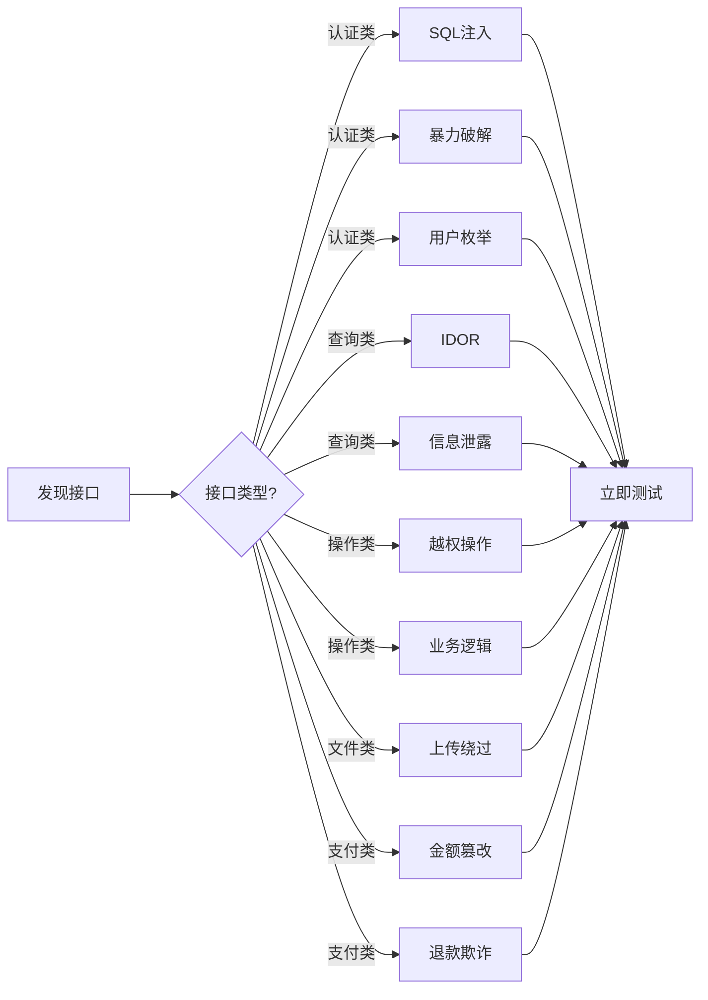
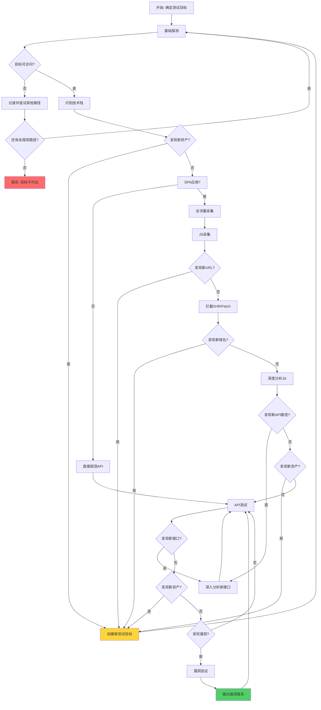

### 场景化扫描流程（自动选择）

```
根据测试时间选择扫描深度：

【quick_scan】5分钟快速扫描
├─ 目标：快速发现明显漏洞
└─ 流程：
   ├─ HTTP探测 + 技术栈识别
   ├─ 关键路径探测(/admin, /api, /login)
   └─ 快速漏洞测试(GET参数+常见头部

【normal_scan】20分钟标准扫描
├─ 目标：全面发现漏洞
└─ 流程：
   ├─ 所有基础探测
   ├─ JS静态分析(快速正则)
   ├─ 关键端点测试
   └─ 漏洞验证 + 报告输出

【deep_scan】1小时深度扫描
├─ 目标：完整渗透测试
└─ 流程：
   ├─ Playwright动态采集(Fallback机制)
   ├─ JS深度分析(AST+正则+路径推断)
   ├─ 全量API端点测试
   ├─ 认证绕过测试矩阵
   ├─ SQL注入深入利用(判断类型+可利用性)
   ├─ 漏洞链构造
   └─ 完整报告输出
```

### 依赖自动Fallback机制

```
【问题】单一工具失败导致测试中断

【解决方案】多方案自动切换

def collect_with_fallback(url):
    """
    1. Playwright (优先)
       - 优势：动态采集、JS执行、交互触发
       - 失败：系统依赖缺失、超时
    """
    try:
        from playwright.sync_api import sync_playwright
        with sync_playwright() as p:
            browser = p.chromium.launch(headless=True)
            # ...采集逻辑
    except DepMissingError:
        # 自动检测依赖问题
        pass  # 切换下一方案
    except TimeoutError:
        pass  # 切换下一方案
    """
    except Exception as e:
        logger.warning(f"Playwright失败: {e}")

    """
    # 方案2: Selenium (备用)
    try:
        from selenium import webdriver
        driver = webdriver.Chrome()
        # ...采集逻辑
    except WebDriverException:
        pass  # 切换下一方案
    except Exception as e:
        logger.warning(f"Selenium失败: {e}")

    """
    # 方案3: requests静态分析 (保底)
    # 只分析HTML+JS，不执行动态JS
    r = requests.get(url)
    # 提取所有JS文件
    js_files = re.findall(r'<script[^>]+src=["\']([^"\']+)["\']', r.text)
    for js in js_files:
        # 分析JS内容
        pass
    """
    
    # 方案4: curl快速探测 (极限情况)
    # 使用curl批量探测关键路径
    subprocess.run(["curl", "-s", url])

【系统依赖自动安装】
try:
    from playwright.sync_api import sync_playwright
except Exception as e:
    # 检测系统依赖问题
    if "libglib" in str(e) or "Shared object" as e:
        # 自动安装系统依赖
        subprocess.run(["playwright", "install-deps", "chromium"])
    elif "timeout" in str(e).lower():
        # 使用更长的超时时间重试
        pass
```

### 认证自动识别

```
【问题】遇到401不知道如何绕过

【解决方案】认证测试矩阵

def test_auth_bypass(url):
    """
    测试顺序：
    1. 无认证直接访问
    """
    r = requests.get(url)
    if r.status_code == 200:
        return "无需认证"

    """
    2. 伪造Token
    """
    fake_tokens = [
        "admin_token",
        "null",
        "' OR '1'='1",
        "eyJhbGciOiJIUzI1NiJ9.payload.signature",
    ]
    for token in fake_tokens:
        r = requests.get(url, headers={"Authorization": f"Bearer {token}"})
        if r.status_code == 200:
            return f"Token伪造成功: {token[:20]}"

    """
    3. 尝试从响应中提取token
    """
    # 有些接口会返回token或session
    session = r.headers.get("Set-Cookie", "")
    if session:
        return f"Cookie: {session[:50]}"

    """
    4. 测试参数注入
    """
    # 有时token在参数中
    r = requests.get(url + "?token=admin")

    """
    5. 测试头部注入
    """
    headers_to_test = [
        {"X-Api-Key": "admin"},
        {"X-Auth-Token": "admin"},
        {"Authorization": "Basic YWRtaW46YWRtaW4="},  # admin:admin base64
    ]

    return "未找到认证绕过"
```

### SQL注入类型自动判断

```
【问题】将配置错误当作注入报告

【解决方案】注入类型分类

def analyze_sqli_type(response):
    """
    1. 判断是否是MyBatis配置错误
    """
    if "ibator" in response or "mybatis" in response.lower():
        if "#{" in response or "${" in response:
            return {
                "type": "MyBatis参数化配置不当(非注入",
                "risk": "低",
                "suggestion": "后端使用了${}但框架层面有防护"
            }

    """
    2. 判断是否是SQL注入
    """
    if "sql" in response.lower() and "error" in response.lower():
        return {
            "type": "SQL注入",
            "risk": "高",
            "suggestion": "存在SQL注入漏洞"
        }

    """
    3. 判断是否可利用
    """
    # 检查是否有报错注入、时间盲注、布尔盲注等利用方式
    return {"type": "需要进一步测试", "risk": "未知"}
```

### JS智能分析（分层提取）

```
【问题】大文件正则匹配效率低，API提取不准

【解决方案】三层提取法

def extract_apis(js_content):
    """
    第一层：快速正则扫描（80% API）
    - 优势：快速，适用大多数情况
    """
    patterns = [
        r'["\'](/[a-zA-Z0-9_/-]+(?:login|user|admin|menu|api|get|save|update|delete)[^"\']*)["\']',
        r'axios\.[a-z]+\(["\']([^"\']+)["\']',
        r'\.get\(["\']([^"\']+)["\']',
        r'\.post\(["\']([^"\']+)["\']',
    ]
    apis = []
    for p in patterns:
        apis.extend(re.findall(p, js_content))
    
    """
    第二层：Vue路径推断（10%）
    - 从Vue组件路径推断可能的API
    - Vue: /views/user/UserList.vue → API: /api/user/list
    """
    vue_paths = re.findall(r'/views/([a-zA-Z0-9_/-]+)\.vue', js_content)
    for path in vue_paths:
        parts = path.split('/')
        # 转换Vue路径为API路径
        api = '/api/' + '/'.join(parts)
        apis.append(api)
    
    """
    第三层：请求拦截验证（10%）
    - 使用Playwright访问，拦截真实请求
    """
    # 见Playwright采集流程

    return deduplicate(apis)
```

### 交互自动触发

```
【问题】Playwright只采集静态资源，无法触发登录等操作

【解决方案】自动模拟用户交互

def auto_interact(page):
    """
    1. 点击页面触发加载
    """
    try:
        page.click('body')
        page.wait_for_timeout(2000)
    except:
        pass
    
    """
    2. 滚动页面触发懒加载
    """
    try:
        page.evaluate('window.scrollTo(0, document.body.scrollHeight)')
        page.wait_for_timeout(2000)
    except:
        pass
    
    """
    3. 填写登录表单并提交
    """
    try:
        # 查找输入框
        inputs = page.query_selector_all('input')
        for inp in inputs[:5]:
            try:
                inp.click()
                inp.type('test', delay=100)
                page.wait_for_timeout(500)
            except:
                pass
        
        # 点击提交按钮
        submit_btn = page.query_selector('button[type="submit"]')
        if submit_btn:
            submit_btn.click()
            page.wait_for_timeout(3000)
    except:
        pass
    
    """
    4. 导航到其他页面
    """
    try:
        # 尝试点击菜单链接
        links = page.query_selector_all('a[href]')
        for link in links[:3]:
            href = link.get_attribute('href')
            if href and not href.startswith('#'):
                link.click()
                page.wait_for_timeout(2000)
    except:
        pass
```

---

## 前置检查

### 授权确认

**执行前必须确认**：
- 用户是否拥有目标的合法授权
- 测试范围是否明确
- 是否需要保密协议(NDA)

### 依赖可用性

当工具不可用时，按此顺序尝试：

```
1. requests 不可用
   → pip install requests

2. playwright 不可用
   → pip install playwright && playwright install chromium
   → playwright install-deps chromium  # 安装系统依赖
   → 自动检测系统依赖缺失并安装：
      try:
          from playwright.sync_api import sync_playwright
          with sync_playwright() as p:
              p.chromium.launch(headless=True)
      except Exception as e:
          if "libglib" in str(e) or "Shared object" in str(e):
              subprocess.run(["playwright", "install-deps", "chromium"])

3. MCP工具有效时优先使用
   → headless_browser 可用于JS动态采集
```

### 授权确认

**执行前必须确认**：
- 用户是否拥有目标的合法授权
- 测试范围是否明确
- 是否需要保密协议(NDA)

---

## 核心检测思维

### 发现即测原则

**正确做法**：发现接口 → 立即测试相关漏洞



**发现即测行动指南**：

```
发现 Swagger → 立即访问获取更多API
发现 Actuator → 立即测试敏感端点
发现登录接口 → 立即测试注入/爆破
发现查询接口 → 立即测试IDOR
发现文件上传接口 → 立即测试上传绕过
```

**API类型对应测试重点**：

| API类型 | 发现后立即测试 |
|---------|---------------|
| 认证类 (login, auth) | SQL注入、暴力破解、用户枚举 |
| 查询类 (list, get, search) | IDOR、信息泄露、参数注入 |
| 操作类 (add, modify, delete) | 越权、批量操作、业务逻辑 |
| 文件类 (upload, download) | 上传绕过、恶意文件、路径遍历 |
| 支付类 (pay, refund, order) | 金额篡改、支付绕过、退款欺诈 |

### 遇到查询类接口时的推理

当你发现一个用于查询数据的接口时：

```
思考：这个接口查的是什么数据？需要认证吗？能查到别人的数据吗？
```

**推理步骤**：
1. 这个接口查询需要什么参数？（userId、phone、orderNo...）
2. 不带参数能查到数据吗？
3. 带别人的ID能查到数据吗？（IDOR）
4. 响应中有没有敏感字段？（password、token、余额...）

**示例**：
```
你发现：GET /api/user/info?userId=123
思考：
  - 需要认证吗？→ 测试不带token
  - 能查其他用户吗？→ 测试userId=124
  - 响应有敏感字段吗？→ 检查password、token等
```

### 遇到认证类接口时的推理

当你发现登录、注册接口时：

```
思考：认证机制安全吗？能绕过吗？能枚举用户吗？
```

**推理步骤**：
1. 不带认证信息能访问吗？
2. 伪造token能通过吗？（JWT alg:none）
3. 用户不存在时的响应有区别吗？（用户枚举）
4. 有短信验证码吗？能轰炸吗？

**示例**：
```
你发现：POST /api/login
思考：
  - SQL注入？→ 测试 username=' OR '1'='1
  - 暴力破解？→ 多次尝试错误密码
  - 用户枚举？→ 测试不存在的用户
```

### 遇到资金/订单类接口时的推理

当你发现支付、退款、订单接口时：

```
思考：钱能转走吗？订单能篡改吗？能刷单吗？
```

**推理步骤**：
1. 订单归属校验了吗？（用A的token能操作B的订单吗？）
2. 金额能篡改吗？（改成0.01）
3. 退款接口需要什么权限？能绕过吗？

**示例**：
```
你发现：POST /api/pay/refund
思考：
  - 需要认证吗？→ 不带token测试
  - 需要自己的订单吗？→ 尝试他人的orderNo
  - 金额能改成0吗？→ amount=0测试
```

### 遇到用户信息接口时的推理

当你发现返回用户资料的接口时：

```
思考：别人的资料能拿到吗？密码暴露了吗？能修改吗？
```

**推理步骤**：
1. 不带token能拿到吗？
2. 响应里有password吗？
3. 能通过phone/email找到userId吗？
4. 修改接口有校验吗？能改别人的吗？

**示例**：
```
你发现：GET /api/user/info?phone=138xxx
思考：
  - 返回userId了吗？→ 记录
  - 返回password了吗？→ 漏洞
  - userId=124能查到吗？→ IDOR测试
```

### 发现即测的例外

**以下情况需要先验证，再深入**：

```
1. 发现返回200但内容异常
   → 不要直接报告漏洞
   → 先验证：是真实数据还是WAF拦截页？

2. 发现可疑的响应差异
   → 不要直接报告漏洞
   → 先多次请求确认差异是否稳定

3. 发现疑似敏感信息
   → 不要直接报告漏洞
   → 先确认：这是业务数据还是测试数据？
```

### 响应分析思维

当你看到响应时：
```
1. 这个响应正常吗？ → 检查状态码
2. 有敏感字段吗？ → 搜索password/token/secret
3. 有ID类字段吗？ → 尝试遍历
4. 有手机号吗？ → 尝试用户枚举
5. 有订单号吗？ → 尝试越权操作
```

### 三步验证流程

```
第一步：发现 (Discover)
  - 可疑的响应差异
  - 异常的状态码
  - 敏感信息暴露

第二步：分析 (Analyze)
  - 多次请求确认差异
  - 对比正常/异常请求
  - 检查WAF/路由/认证

第三步：验证 (Verify)
  - 确认为漏洞 → 收集证据 → 报告
  - 排除为误报 → 记录原因 → 继续
```

### 验证检查清单（10维度）

```
□ 维度1: 响应类型 - JSON还是HTML？(HTML可能是WAF)
□ 维度2: 状态码 - 是否合理？
□ 维度3: 响应长度 - 是否过短？
□ 维度4: WAF拦截 - 是否为安全设备？
□ 维度5: 敏感信息 - 是否包含password/token？
□ 维度6: 一致性 - 多次请求是否一致？
□ 维度7: SQL注入 - 是否包含SQL错误？
□ 维度8: IDOR - 是否返回他人数据？
□ 维度9: 认证绕过 - 是否返回token？
□ 维度10: 信息泄露 - 是否泄露非公开信息？
```

---

## 敏感信息识别

### 必须识别的敏感字段

```
password     → 不应返回前端
token        → 可能存在泄露
secretKey    → 不应暴露
apiKey       → 不应暴露
balance      → 可能存在越权
orderNo      → 可能被篡改
userId       → 可用于越权测试
phone        → 可用于用户枚举
email        → 可用于钓鱼
```

### 响应类型判断

| 响应类型 | 特征 | 含义 |
|----------|------|------|
| JSON对象 | `{"code":200,"data":{}}` | 真实API响应 |
| JSON数组 | `[{"id":1},...]` | 真实数据列表 |
| HTML页面 | `<!DOCTYPE html>` | SPA路由/WAF/错误页 |
| 空响应 | 长度<50字节 | 错误/空数据 |
| 重定向 | HTTP 301/302 | 需要认证/跳转 |

---

## 测试优先级

当发现多个问题时，按此顺序处理：

```
1. 立即可利用的漏洞（SQL注入、认证绕过）
2. 信息泄露（Swagger、Actuator暴露）
3. 业务逻辑漏洞（越权、支付篡改）
4. 枚举类漏洞（用户枚举）
```

---

## 漏洞链构造思维

### 发现用户枚举后的推理

```
发现的：GET /api/user/check?phone=138xxx 返回 userId

利用链：
1. 收集更多userId → 批量探测手机号
2. 用userId查更多信息 → GET /api/user/info?userId=xxx
3. 尝试修改他人资料 → POST /api/user/update
4. 查看他人订单 → GET /api/order/list?userId=xxx

最终：用户枚举 → 获取userId → 查订单 → 退款
```

### 发现token泄露后的推理

```
发现的：{"token": "xxx", "userId": 123}

利用链：
1. token有效吗？ → 用token访问其他接口
2. 能访问admin接口吗？ → GET /api/admin/xxx
3. token能用于其他用户吗？ → 改userId重放

最终：token泄露 → 用token访问敏感接口 → 越权操作
```

---

## HTTP方法与测试策略

### 不同方法的测试重点

| 方法 | 测试重点 |
|------|----------|
| GET | 参数遍历、IDOR、信息泄露 |
| POST | 认证绕过、业务逻辑、注入 |
| PUT | 资源篡改、越权修改 |
| DELETE | 资源删除、越权删除 |
| PATCH | 部分更新、字段覆盖 |

### 参数测试思维

```
接口：GET /api/xxx?param=value

测试顺序：
1. param=空值
2. param=正常值
3. param=特殊字符 (' " < >)
4. param=SQL注入 (1' OR '1'='1)
5. param=XSS (<script>alert(1)</script>)
6. param=路径遍历 (../../../etc/passwd)
7. param=其他用户的值 (IDOR)
```

## 认证上下文理解

### 发现登录接口后

```
发现的：POST /api/login {"username":"xxx","password":"xxx"}

思考：
1. 返回token吗？ → 记录token
2. 返回userId吗？ → 记录userId
3. 响应有什么区别？ → 用户枚举
4. 有验证码吗？ → 暴力破解难度

接下来用这个token：
- 访问 GET /api/user/info
- 访问 GET /api/order/list
- 尝试 GET /api/admin/xxx (测试权限)
```

### 发现token但不知道用法时

```
发现的：token=eyJhbGciOiJIUzI1NiJ9...

思考：
1. JWT吗？ → 解码看payload
2. 放在哪？ → Authorization: Bearer token
3. 哪个接口用？ → 尝试访问需要认证的接口
4. userId是什么？ → 从token解码获取
```

## 常见漏洞模式识别

### 用户相关漏洞模式

| 模式 | 特征 | 测试 |
|------|------|------|
| 用户信息泄露 | 响应包含password、token | 不带认证访问 |
| 用户枚举 | 用户存在/不存在响应不同 | 探测不存在的手机号/邮箱 |
| 密码重置漏洞 | 可通过phone/email重置 | 尝试修改他人密码 |
| 越权访问 | 通过参数切换用户 | 修改userId/phone参数 |

### 订单相关漏洞模式

| 模式 | 特征 | 测试 |
|------|------|------|
| 订单遍历 | 参数化查询订单 | 修改userId查他人订单 |
| 订单篡改 | 订单金额可修改 | 尝试amount=0.01 |
| 虚假订单 | 可创建任意订单 | 构造恶意订单数据 |
| 退款绕过 | 退款接口无校验 | 使用他人orderNo退款 |

### 认证相关漏洞模式

| 模式 | 特征 | 测试 |
|------|------|------|
| JWT伪造 | alg:None或不验签 | 修改payload重放 |
| 暴力破解 | 无验证码、无限流 | 多次尝试密码 |
| 会话固定 | 登录后session不变 | 登录前后cookie对比 |
| 登出后令牌仍有效 | token注销机制缺失 | 登出后重放token |

### CORS配置错误（高危！）

**识别特征**：
```
响应头包含：
- Access-Control-Allow-Origin: <任意origin>
- Access-Control-Allow-Credentials: true

危险配置示例：
- Access-Control-Allow-Origin: https://evil.com
- Access-Control-Allow-Credentials: true
```

**测试方法**：
```python
# 1. 测试不同Origin的CORS响应
origins = [
    "https://evil.com",
    "https://attacker.com",
    "null",
]

for origin in origins:
    r = requests.get(api_url, headers={"Origin": origin})
    allow_origin = r.headers.get('Access-Control-Allow-Origin')
    allow_cred = r.headers.get('Access-Control-Allow-Credentials')
    
    if allow_origin == origin and allow_cred == 'true':
        print(f"[CORS漏洞] Origin={origin} 被信任！")

# 2. 判断是否脆弱
if allow_origin == origin or allow_origin == "*":
    if allow_cred == 'true':
        # 严重漏洞！任意网站可以获取用户凭证
```

**影响**：
```
1. 任意第三方网站可以获取用户的认证token
2. 攻击者可以读取、修改用户的请求和响应
3. 结合用户枚举，确认用户身份后发起针对性攻击

攻击场景：
1. 用户登录目标系统
2. 用户被诱骗访问攻击者控制的恶意页面
3. 恶意页面中的JavaScript发起跨域请求
4. 由于CORS配置错误，攻击者获取完整响应数据
```

**修复建议**：
```
1. 使用CORS白名单机制，只允许信任的域名
2. 当设置 Allow-Credentials 时，Origin 必须是具体域名，不能是 *
3. 定期审查CORS配置
```

## 特殊情况处理

### 遇到WAF/安全设备时

```
识别特征：
- 所有请求返回相似的HTML页面
- 响应包含"拦截"、"安全"、"访问受限"等关键词
- 响应内容与实际API无关

处理方法：
1. 识别为WAF拦截，不是漏洞
2. 记录"存在WAF防护"作为安全能力
3. 可以尝试降低请求频率绕过

判断逻辑：
- 请求1: 返回业务JSON = 正常
- 请求2: 返回HTML拦截页 = WAF
- 请求3: 返回业务JSON = 恢复
```

### 遇到SPA应用时

```
识别特征：
- /api/* 路径返回HTML页面
- 响应内容是前端框架代码
- 不是真实的API端点

处理方法：
1. 通过JS源码分析获取真实API配置
2. 使用无头浏览器触发动态API请求
3. 不要对SPA路由的/api/*路径直接测试

判断逻辑：
- GET /api/user/info 返回HTML = SPA前端路由
- GET /api/user/info 返回JSON = 真实API
```

### 遇到加密/混淆的数据时

```
思考：
- 能解密吗？ → 查看前端JS代码
- 有密钥泄露吗？ → 检查响应、注释
- 能绕过吗？ → 不带加密参数试试
```

### 遇到WAP环境时

```
识别特征：
- 需要保持Cookie才能访问
- 需要正确的Referer来源
- 需要特定Header（如User-Agent、X-Requested-With）

处理方法：
1. Cookie维护
   - 首次访问获取session cookie
   - 后续请求保持cookie不退化
   - 使用requests.Session()维持会话

2. 来源伪造
   - 添加正常页面的Referer
   - 如 Referer: http://target.com/index

3. Header复制
   - 从浏览器复制完整请求头
   - 特别关注：X-Requested-With, Content-Type

判断逻辑：
- 请求不带cookie返回302 → 需要Cookie
- 请求不带Referer返回异常 → 需要Referer
- 请求Header不全返回异常 → 检查缺失Header
```

### 遇到验证码/限流时

```
思考：
- 验证码能绕过吗？ → 改参数、删cookie
- 限流能绕过吗？ → 改IP、延时
- 有风控吗？ → 行为异常检测
```

### 常见误报识别

```
这些不是漏洞（识别为误报）：
1. HTTP 200 返回 HTML 页面
   → 可能是WAF拦截页/SPA路由/默认错误页
   → 验证：是否是JSON格式的业务数据？

2. 响应长度完全相同但返回"登录失效"
   → 说明后端有正确的认证检查
   → 不是漏洞，是安全防护有效

3. 所有ID查询返回相同响应
   → 可能是统一错误处理
   → 验证：是否真的返回了不同的业务数据？
```

---

前置检查完成。接下来进入测试流程。

## SPA应用完整采集流程

### 流程图（循环迭代模型）



**核心原则**：渗透测试是**循环迭代**过程，不是线性流程！

```
【重要】每个阶段都可能发现新线索：
- 基础探测 → 发现新域名/路径 → 加入探测队列
- JS采集 → 发现新的子域名/外部API → 创建新目标
- API测试 → 发现新接口 → 深入分析
- 漏洞验证 → 发现新资产 → 开启新一轮测试
```

### 【实战教训】从测试中发现的问题

```
【教训1】发现新URL/接口必须深入测试

错误做法：
- 发现 /idaas/jwtLogin → 只记录"新的登录接口"
- 遗漏了：这是独立的微服务，可能有独立漏洞

正确做法：
1. 发现 /idaas/jwtLogin
2. 深入分析：查找所有 idaas 相关接口
3. 发现更多：/idaas/jwtLogout, /idaas/refresh, id_token, idaas_token
4. 评估影响：微服务架构信息泄露，独立认证体系

【教训2】不只关注漏洞，要关注情报

漏洞只是结果，信息收集是过程。

需要收集的情报：
- 微服务架构（发现了哪些独立服务）
- 认证体系（几种Token，之间的关系）
- 第三方集成（CDN、地图、推送服务）
- 内部地址（内网IP、内部域名）
- 技术栈细节（框架版本、组件库）

【教训3】发现任何异常都要追问

异常示例：
- /idaas/jwtLogin 返回 "idaas服务未找到" → 服务存在但不可用
- 某个接口返回不同的错误码 → 可能暴露内部逻辑
- 某个路径返回HTML而非JSON → 可能暴露路由结构

【教训4】信息泄露也是风险

不只是漏洞才需要报告：
- 微服务标识（idaas）
- 技术栈指纹（Vue、React、Spring Boot）
- 内部地址（10.x.x.x、172.16.x.x）
- 第三方服务（友商SDK、云服务）
```

### 阶段1：基础探测

```
1. HTTP探测目标可访问性
   curl -I http://target.com
   
2. 技术栈识别
   - 检查响应头Server字段
   - 检查HTML中是否包含Vue/React/Angular关键词
   - 检查是否包含webpack chunk引用
   
3. 判断是否是SPA应用
   - /api/* 返回HTML → SPA
   - HTML包含JS chunk路径 → Vue/React应用

4. 【新增】全流量监听
   - 捕获所有出站请求（不只是JS）
   - 记录所有第三方域名（CDN、分析服务等）
   - 记录所有静态资源加载

5. 【新增】发现新资产时的处理
   发现新域名 → 添加到测试队列 → 继续探测
   发现新路径 → 递归探测 → 继续
```

### 【重要】为什么要捕获所有流量？

```
很多信息不只在JS中：

1. XHR/Fetch请求
   - 动态加载的数据
   - 延迟加载的模块
   - 用户交互才触发的API

2. 静态资源
   - 图片文件名可能泄露ID
   - CSS中的隐藏路径
   - Font文件名可能有线索

3. 第三方请求
   - CDN可能暴露内部路径
   - 统计分析服务可能包含敏感参数
   - 地图/推送服务可能暴露内网地址

4. WebSocket连接
   - 实时通信接口
   - 推送通知端点
```

### 【重要】base_path可能是多个！

```
【教训】不要局限于单一base_path！

错误做法：
- 只测试 /api/*
- 遗漏大量接口

正确做法：
1. 从JS中提取所有可能的base_path
2. 从响应头/响应内容中推测
3. 使用多个base_path分别测试

从JS中发现：
- /api/v1/user/info
- /admin/user/list
- /gateway/api/user

可能的base_path：
- /api/v1 (版本前缀)
- /api (API前缀)
- /admin (后台前缀)
- /gateway (网关前缀)
- / (根路径)

每个base_path都要测试！
```

### 阶段2：JS采集（必须使用Playwright）

```
【核心目标】捕获所有流量，不只分析JS文件！

1. Playwright全流量采集
   from playwright.sync_api import sync_playwright
   
   ALL_TRAFFIC = []
   
   with sync_playwright() as p:
       browser = p.chromium.launch(headless=True)
       page = browser.new_page()
       
       # 拦截所有请求
       def on_request(request):
           ALL_TRAFFIC.append({
               'url': request.url,
               'method': request.method,
               'headers': dict(request.headers),
               'type': request.resource_type
           })
       
       # 拦截所有响应
       def on_response(response):
           ALL_TRAFFIC.append({
               'url': response.url,
               'status': response.status,
               'headers': dict(response.headers),
               'type': response.resource_type
           })
       
       page.on('request', on_request)
       page.on('response', on_response)
       
       try:
           page.goto(url, wait_until='domcontentloaded', timeout=30000)
       except:
           pass
       
       page.wait_for_timeout(8000)  # 等待JS完全执行
       
       # 【重要】模拟用户操作触发更多API！
       try:
           # 1. 点击页面触发加载
           page.click('body')
           page.wait_for_timeout(2000)
           
           # 2. 如果有登录表单，尝试触发登录接口
           try:
               # 查找登录按钮
               page.click('button[type="submit"]')
               page.wait_for_timeout(3000)
           except:
               pass
           
           # 3. 触发更多交互（滚动、悬停等）
           page.evaluate('window.scrollTo(0, document.body.scrollHeight)')
           page.wait_for_timeout(2000)
           
           # 4. 模拟输入框获取焦点
           try:
               inputs = page.query_selector_all('input')
               for inp in inputs[:3]:
                   inp.click()
                   inp.type('test')
                   page.wait_for_timeout(500)
           except:
               pass
           
       except Exception as e:
           print(f'交互操作失败: {e}')

2. 【重要】多目标队列管理机制

   【核心问题】同时发现多目标时如何管理？
   
   ```
   # 多目标测试队列
   TEST_QUEUE = []        # 待测试目标队列
   TESTED = set()        # 已测试目标
   
   # 发现新目标时的处理
   def on_discover_target(url, target_type):
       if url not in TESTED and url not in [t['url'] for t in TEST_QUEUE]:
           TEST_QUEUE.append({
               'url': url,
               'type': target_type,  # SPA前端/API/子域名
               'parent': current_target,
               'discovered_from': 'js_analysis'
           })
   
   # 迭代处理队列
   while TEST_QUEUE:
       current = TEST_QUEUE.pop(0)
       TESTED.add(current['url'])
       test_target(current)
   ```
   
   【多目标发现场景】
   - 发现新子域名：console.ncszkpark.com → cdp-api.ncszkpark.com
   - 发现新路径：/ipark-admin → /ipark-wxlite
   - 发现新服务：主站 → /idaas认证服务
   
   【处理原则】
   - 发现新域名 → 加入TEST_QUEUE → 继续当前目标 → 后续处理
   - 发现新路径 → 加入TEST_QUEUE → 继续当前目标
   - 发现新服务 → 加入TEST_QUEUE → 深入分析当前目标

3. 【重要】配置文件发现后的持续采集

   【问题】发现_app.config.js后只分析了配置，没有继续采集
   
   ```
   # 发现配置文件后的正确流程：
   1. 立即分析配置文件 → 提取API配置
   2. 【继续使用Playwright采集】→ 不要中断！
   3. 用Playwright访问配置文件中的URL
   4. 用Playwright触发登录等操作
   
   # 示例：
   发现 VITE_GLOB_API_URL = /ipark
   发现 VITE_GLOB_DOMAIN_URL = https://console.ncszkpark.com/
   
   # 继续用Playwright：
   1. page.goto('https://console.ncszkpark.com/ipark-admin')
   2. page.click('button[type="submit"]')  # 触发登录
   3. 拦截登录API请求 → 发现真实API端点
   ```

3. 【重要】配置文件URL分类测试（curl批量探测）

   【问题】发现配置文件的URL后不知道是API接口还是Web路由
   
   【解决方案】批量curl探测 + 自动分类
   
   ```
   # 配置文件URL分类测试流程
   def classify_config_urls(config_urls):
       """
       1. 对配置中的所有URL进行批量curl探测
       2. 根据响应判断类型：
          - JSON响应 → API接口 → 直接curl测试漏洞
          - HTML响应 → Web路由 → Playwright访问测试
       """
       api_urls = []      # 疑似API接口
       route_urls = []    # 疑似Web路由
       
       for url in config_urls:
           full_url = url if url.startswith('http') else base_url + url
           
           try:
               r = requests.get(full_url, timeout=5, verify=False)
               ct = r.headers.get('Content-Type', '')
               content_len = len(r.text)
               
               # 判断类型
               if 'json' in ct.lower():
                   # JSON响应 → API接口
                   api_urls.append((url, full_url, r))
                   
               elif content_len > 500 and ('<html' in r.text.lower() or '<!doctype' in r.text.lower()):
                   # HTML响应 → Web路由
                   route_urls.append((url, full_url))
                   
               elif r.status_code == 200 and content_len > 0:
                   # 可能是重定向或特殊响应
                   route_urls.append((url, full_url))
                   
               else:
                   # 其他 → 需要进一步测试
                   route_urls.append((url, full_url))
                   
           except Exception as e:
               # 连接失败 → 可能是内网服务
               pass
       
       return api_urls, route_urls
   
   # 对API接口直接curl测试漏洞
   def test_api_vulns(api_urls):
       for url, full_url, response in api_urls:
           # CORS测试
           r = requests.get(full_url, headers={'Origin': 'https://evil.com'})
           if r.headers.get('Access-Control-Allow-Origin'):
               print(f"[CORS] {url}")
           
           # SQL注入测试
           r = requests.get(full_url + "'")
           if 'sql' in r.text.lower() or 'error' in r.text.lower():
               print(f"[SQLi] {url}")
   
   # 对Web路由使用Playwright访问
   def test_routes_with_browser(route_urls):
       for url, full_url in route_urls:
           # 使用Playwright访问
           page.goto(full_url)
           # 拦截请求，分析页面结构
   ```

   【实战案例】
   从配置文件发现：
   - VITE_GLOB_API_URL: /ipark
   - VITE_GLOB_APP_LICENSE: /ipark-wxlite/no-license
   
   curl探测结果：
   - /ipark → HTML响应 → Web路由
   - /ipark-wxlite/* → 404 → 需要POST测试
   
   【重要】POST探测同样重要！
   ```
   # 对404的路径进行POST测试
   for url in route_urls:
       r_post = requests.post(full_url, json={})
       if r_post.status_code not in [404, 405]:
           print(f"[疑似API] {url} - POST可访问")
   ```

4. 【重要】简化JS字符串匹配（避免正则错误）
   
   ```
   # 复杂正则容易失败，使用简单字符串匹配
   def extract_strings(content):
       patterns = [
           r'["\']([/][a-zA-Z0-9_/-]+)["\']',  # 路径
           r'["\'](https?://[^\s"\'\\]+)["\']',  # URL
       ]
       found = []
       for p in patterns:
           found.extend(re.findall(p, content))
       return found
   
   def analyze_js_simple(content):
       strings = extract_strings(content)
       for s in strings:
           if len(s) > 5 and '/' in s:
               if any(kw in s.lower() for kw in ['login', 'user', 'admin', 'api', 'getInfo', 'save']):
                   ALL_APIS.add(s)
   ```

2. 【重要】Playwright失败时的Fallback机制
   
   如果Playwright无法捕获流量，使用静态下载：
   ```python
   # 直接下载所有JS文件
   def download_and_analyze_js(target_url):
       # 1. 获取HTML
       html = requests.get(target_url).text
       
       # 2. 提取所有JS路径
       js_paths = re.findall(r'<script[^>]+src=["\']([^"\']+)["\']', html)
       
       # 3. 递归下载并分析每个JS文件
       for js_path in js_paths:
           # 处理相对路径
           if js_path.startswith('http'):
               url = js_path
           elif js_path.startswith('/'):
               url = target_url + js_path
           else:
               url = target_url + '/' + js_path
           
           # 下载JS
           content = requests.get(url).text
           
           # 立即分析
           analyze_js_content(content)
           
           # 查找chunk引用
           find_and_download_chunks(content, url)
   ```

3. 【重要】递归下载所有JS文件（包括chunk）
   
   ```python
   def find_and_download_chunks(js_content, base_url):
       # 1. 查找chunk引用
       chunk_patterns = [
           r'chunk-([a-zA-Z0-9]+)\.js',
           r'"\.\/static\/js\/([^"]+)"',
           r'"static\/js\/([^"]+)"'
       ]
       
       for pattern in chunk_patterns:
           chunks = re.findall(pattern, js_content)
           for chunk in chunks:
               if isinstance(chunk, str) and 'chunk' in chunk:
                   # 下载chunk文件
                   chunk_url = f"{base_url}/static/js/{chunk}.js"
                   chunk_content = requests.get(chunk_url).text
                   # 递归分析
                   analyze_js_content(chunk_content)
   ```

4. 【重要】AST+正则混合分析

   ```python
   def analyze_js_content(content):
       # 1. 正则提取API路径
       api_patterns = [
           r'["\'](/[a-zA-Z0-9_/.-]+)["\']',  # 简单路径
           r'axios\.[a-z]+\(["\']([^"\']+)["\']',  # axios请求
           r'fetch\(["\']([^"\']+)["\']',  # fetch请求
           r'\.get\(["\']([^"\']+)["\']',  # .get请求
           r'\.post\(["\']([^"\']+)["\']',  # .post请求
       ]
       
       for pattern in api_patterns:
           matches = re.findall(pattern, content)
           for match in matches:
               if isinstance(match, str) and len(match) > 2:
                   if '/' in match:
                       ALL_APIS.add(match)
       
       # 2. 正则提取完整URL
       url_patterns = [
           r'["\'](https?://[^"\']+)["\']',
           r'baseURL["\s:]+["\']([^"\']+)["\']',
       ]
       
       for pattern in url_patterns:
           matches = re.findall(pattern, content)
           for match in matches:
               if match and len(match) > 5:
                   ALL_URLS.add(match)
       
       # 3. 正则提取Token和配置
       config_patterns = [
           r'(?:access_token|token|Token)["\s]*[:=]["\s]*["\']([^"\']+)["\']',
           r'VUE_APP[\w]+["\s:]+["\']([^"\']*)["\']',
           r'(?:apiKey|api_key|secret)["\s]*[:=]["\s]*["\']([^"\']+)["\']',
       ]
       
       for pattern in config_patterns:
           matches = re.findall(pattern, content, re.IGNORECASE)
           for match in matches:
               if match and len(match) > 5:
                   ALL_CONFIGS.add(match)
       
       # 4. 正则提取IP地址
       ip_pattern = r'\b(?:10\.\d{1,3}|172\.(?:1[6-9]|2\d|3[01])|192\.168)\.\d{1,3}\.\d{1,3}\b'
       ips = re.findall(ip_pattern, content)
       for ip in ips:
           ALL_IPS.add(ip)
   ```

5. 【重要】拦截并记录所有流量类型
   - xhr: API请求
   - fetch: API请求
   - document: HTML页面
   - script: JS文件
   - stylesheet: CSS文件
   - image: 图片资源
   - font: 字体文件
   - websocket: WebSocket连接
   - other: 其他

3. 【重要】发现新资产时的迭代流程
   
   for traffic in ALL_TRAFFIC:
       url = traffic['url']
       
       # 提取新域名
       if is_new_domain(url):
           new_targets.append(url)  # 加入新测试目标
       
       # 提取新路径
       if is_new_path(url):
           new_endpoints.append(url)  # 加入新测试队列
       
       # 提取新API
       if is_api(url):
           api_endpoints.append(url)

4. 从所有流量中提取信息
   - XHR/Fetch请求 → API端点
   - 静态资源URL → 可能的ID/路径线索
   - 第三方域名 → 关联系统
   - WebSocket → 实时通信接口

5. 采集敏感信息
   - localStorage: 检查token、key等敏感数据
   - sessionStorage: 会话信息
   - cookies: 会话Cookie
   - 响应头: 提取server版本、IP、域名信息

6. 【重要】同时检查配置文件
   - 尝试访问 /{app}/_app.config.js
   - 提取 VITE_GLOB_API_URL 等配置
   - 配置文件可能包含内网地址！
```

### 阶段3：JS深度分析

```
【核心目标】从所有捕获的流量中提取尽可能多的信息！

1. 提取baseURL配置（最优先！）
   patterns:
   - r'baseURL\s*[:=]\s*["\']([^"\']+)["\']'
   - r'axios\.create\s*\(\s*\{([^}]+)\}'
   - r'VUE_APP_\w+["\s]*[:=]["\s]*["\']([^"\']*)["\']'
   
   重要发现：
   - baseURL:"" 为空 → 使用相对路径 + nginx代理
   - baseURL:"https://api.xxx.com" → 使用配置的域名前缀
   - baseURL不存在 → 使用同源请求
   - VUE_APP_* → Vue环境变量，可能包含敏感配置

2. 【重要】发现新服务/新路径必须深入！

   当发现任何新的服务名称或路径时，必须执行以下步骤：
   
   示例场景：发现 /idaas/jwtLogin
   ```
   步骤1: 提取所有相关路径
      - 在JS中搜索 "idaas"
      - 发现: /idaas/jwtLogin, /idaas/jwtLogout, id_token, idaas_token
      
   步骤2: 分析服务性质
      - jwtLogin → JWT认证服务
      - jwtLogout → 登出服务
      - id_token/idaas_token → 独立的Token体系
      
   步骤3: 测试该服务所有接口
      - /idaas/jwtLogin
      - /idaas/jwtLogout
      - /idaas/refresh
      - /idaas/token
      
   步骤4: 评估影响
      - 微服务架构信息泄露
      - 独立认证体系
      - 可能存在的漏洞
   ```

3. 提取Token体系信息
   
   发现以下内容时必须分析：
   ```
   - access_token   → 主Token
   - refresh_token → 刷新Token
   - id_token      → 身份Token（可能是独立服务）
   - idaas_token   → 第三方服务Token
   - 其他自定义Token → 分析其用途和关系
   ```

4. 【重要】发现"服务未找到"也要记录！
   
   响应 "xxx服务未找到" 的意义：
   - 服务存在，但当前不可用
   - 可能配置问题
   - 可能需要特定条件才启用
   - 这本身就是一条情报！
```

2. 【重要】分析所有捕获的流量
   # 不要只看JS文件！
   
   for traffic in ALL_TRAFFIC:
       if traffic['type'] == 'xhr' or traffic['type'] == 'fetch':
           # 这就是API端点！
           extract_api(traffic['url'])
           
       elif traffic['type'] == 'document':
           # HTML页面，可能包含内嵌JS
           extract_from_html(traffic['url'])
           
       elif 'api' in traffic['url'] or '/api/' in traffic['url']:
           # URL中包含api的请求
           extract_api_path(traffic['url'])

3. 递归分析所有 chunk 文件
   - webpack 打包的应用会将代码分散到多个 chunk 文件中
   - 大 chunk 文件（>50KB）通常包含更多业务逻辑

4. API端点提取（正则模式）
   patterns:
   - r'["\'](/(?:user|auth|admin|login|logout|api|v\d)[^"\']*)["\']'
   - r'axios\.[a-z]+\(["\']([^"\']+)["\']'
   - r'fetch\(["\']([^"\']+)["\']'
   - r'\.get\(["\']([^"\']+)["\']'
   - r'\.post\(["\']([^"\']+)["\']'

5. 敏感信息提取
   - IP地址: r'\b(?:(?:25[0-5]|2[0-4][0-9]|[01]?[0-9][0-9]?)\.){3}(?:25[0-5]|2[0-4][0-9]|[01]?[0-9][0-9]?)\b'
   - 外部域名: 从URL中提取netloc
   - 凭证信息: r'(?:api[_-]?key|secret[_-]?key)\s*[:=]\s*["\']([^"\']+)["\']'

6. 【重要】内网地址提取
   - 10.x.x.x, 172.16-31.x.x, 192.168.x.x
   - 可能暴露内网架构
   - 可以作为新测试目标
```

### 【重要】base_path快速验证

**发现base_path后，必须立即验证其正确性！**

```
验证方法：
1. 找到一个从JS中发现的完整API路径
2. 分别用不同的base_path前缀尝试
3. 选择返回正确JSON响应的前缀

示例：
从JS中发现路径: /sys/login, /sys/user/getUserInfo
发现的base_path候选: /ipark, /api, /

验证：
- GET /ipark/sys/login      → 200 JSON ✓ (正确)
- GET /api/sys/login        → 404      (错误)
- GET /sys/login            → 可能被拦截

结论：base_path = /ipark
```

### 阶段4：API测试

```
1. 确定base_path（关键！需要多维度获取）

   base_path获取优先级:
   1. 【最优先】配置文件: /{app}/_app.config.js 中的 VITE_GLOB_API_URL
   2. baseURL配置 → 直接使用
   3. Swagger/OpenAPI文档 → 解析其中的basePath
   4. nginx反向代理推测 → 从响应头Server字段分析
   5. JS路径反推 → 从发现的API路径提取共同前缀
   6. 多API共同前缀 → 统计多个API路径的公共部分
   7. 字典fallback

   【重要】多base_path场景：
   - 一个站点可能存在多个base_path（如 /gateway/, /api/, /admin/）
   - 不同模块可能使用不同的base_path
   - 需要结合采集阶段发现的API路径综合判断

   【重要】从JS路径反推base_path：
   发现 API 路径如 /api/v2/user/info 时：
   → 尝试提取共同前缀：/api/v2, /api, /v2
   → 验证每个前缀是否可访问
   → 记录有效的base_path组合

   【重要】Swagger basePath解析：
   → 解析 /swagger-ui.html 或 /v2/api-docs
   → 从Swagger JSON中提取 basePath 字段
   → 注意：Swagger的basePath可能不是完整路径
```

### base_path多维度获取策略

**为什么需要多维度？**
```
问题：一个站点可能存在多个base_path
示例：
- /gateway/api/v1/user/info
- /api/v1/user/info
- /admin/api/v1/user/info

如果只用单一base_path，可能遗漏大量接口！
```

**维度1：从JS路径提取**
```
从JS中发现API路径：
/api/v2/user/list
/api/v2/order/list
/api/v2/payment/list

分析：
- 共同前缀可能是 /api/v2
- 但实际base_path可能是 /api（/v2是版本号）

验证方法：
1. 测试 /api/v2 是否可访问
2. 测试 /api 是否可访问
3. 对比响应判断哪个是真正的base_path
```

**维度2：从Swagger/OpenAPI文档**
```
常见Swagger路径：
- /swagger-ui.html
- /swagger-ui/index.html
- /v2/api-docs
- /api-docs
- /doc.html
- /swagger.json

解析Swagger JSON：
{
  "basePath": "/api/v1",  ← 直接获取base_path
  "host": "api.target.com",
  "paths": {
    "/user/list": {...}   ← 需要拼接basePath
  }
}

注意：Swagger的basePath可能不完整，需要结合host判断完整URL
```

**维度3：从响应头推断**
```
响应头线索：
- Server: nginx/1.x → 可能有nginx反代
- X-Forwarded-For: 可见真实IP
- Location: 302重定向可见路径结构

常见nginx配置模式：
- proxy_pass /api → 实际后端可能是 / 或 /backend
- 不同路径反代到不同后端服务
```

**维度4：多API共同前缀统计**
```
收集到的API路径：
/gateway/api/v1/user/list
/gateway/api/v1/order/list
/api/v1/user/info
/admin/api/v1/user/list

统计共同前缀：
- /gateway/api/v1 出现2次
- /api/v1 出现2次
- /admin/api/v1 出现1次

结论：可能存在3个不同的base_path
→ /gateway/api/v1
→ /api/v1
→ /admin/api/v1

需要分别测试每个base_path下的端点
```

**维度5：字典补充（扩展非通用路径）**
```python
# 非通用base_path字典（根据目标特征选用）
extended_base_paths = [
    # 协议/网关
    "/gateway", "/proxy", "/route", "/ingress",
    "/api-gateway", "/openapi", "/open/api",
    # 版本前缀
    "/v1", "/v2", "/v3", "/v4", "/v5",
    "/api/v1", "/api/v2", "/api/v3",
    "/rest", "/rest/api", "/graphql",
    # 管理后台
    "/admin", "/manager", "/manage", "/console",
    "/backend", "/backoffice", "/cms",
    # 业务模块（根据系统类型添加）
    "/user", "/users", "/member", "/members",
    "/order", "/orders", "/trade", "/transaction",
    "/product", "/goods", "/shop", "/store",
    "/payment", "/pay", "/finance", "/account",
    "/file", "/upload", "/oss", "/storage",
    "/message", "/notify", "/sms", "/email",
    "/admin", "/authority", "/system", "/config",
    # 微服务
    "/service", "/services", "/rpc", "/grpc",
    "/auth", "/oauth", "/sso", "/cas",
    # 移动端
    "/mobile", "/app", "/ios", "/android",
    "/miniapp", "/wechat", "/applet",
]
```

### Fuzzing组合测试

**重要发现**：很多 API 网关只拦截 `/api/*` 路径，根路径可能直接暴露后端服务。

```
1. API前缀字典
   common_api_prefixes = [
       # 已发现
       "/api/admin", "/api/authority", "/api/system",
       # 通用
       "/api", "/api/v1", "/api/v2", "/api/v3", "/api/v4",
       "/rest", "/rest/api", "/webapi",
       # 认证
       "/auth", "/oauth", "/oauth2", "/cas", "/sso",
       # 管理
       "/admin", "/admin/api", "/manager", "/backend",
       # 协议
       "/openapi", "/open/api", "/gateway", "/proxy",
   ]

2. API端点字典
   common_api_endpoints = [
       # 通用CRUD
       "login", "logout", "register", "list", "add", "delete", "modify",
       "getList", "getListOfPage", "detail", "getInfo", "profile",
       # 用户相关
       "user", "user/list", "user/add", "user/delete", "user/modify",
       "user/profile", "user/restPassword", "user/enable", "user/disable",
       # 角色权限
       "role", "role/list", "role/add", "role/delete", "role/modify",
       "menu", "menu/list", "menu/add", "menu/delete", "menu/modify",
       # 文件操作
       "file", "upload", "download", "import", "export",
       "imgUpload", "avatar", "attachment",
   ]

3. Fuzzing测试
   for prefix in common_api_prefixes:
       for endpoint in common_api_endpoints:
           url = target + prefix + "/" + endpoint
           response = requests.get(url)
           # 记录返回200的接口
```

### API根路径探测

**重要发现**：`/`, `/health`, `/metrics` 等路径返回 JSON，表明网关只拦截 `/api/*`。

```
# 测试非/api路径
root_paths = [
    "/", "/login", "/auth", "/oauth", "/sso", "/cas",
    "/health", "/healthz", "/ready", "/status", "/info",
    "/metrics", "/ping", "/actuator",
]

for path in root_paths:
    url = api_base + path
    response = requests.get(url)
    if "json" in response.headers.get("Content-Type", ""):
        # 发现可访问的接口
```

### 业务端点模板扩展

当发现类似 `{resource}/list`、`{resource}/add` 这类 API 模式时：

```
1. 通用CRUD端点模式
   发现的模式: /{module}/{operation}
   可能存在的端点:
   - /{module}/list          → 列表查询
   - /{module}/add          → 新增创建
   - /{module}/modify       → 修改更新
   - /{module}/delete       → 删除操作
   - /{module}/detail       → 详情查看
   - /{module}/getInfo      → 信息获取
   - /{module}/export       → 导出数据
   - /{module}/import       → 导入数据

2. RESTful风格端点模式
   发现的模式: /{resource}/{id}
   可能存在的端点:
   - GET  /{resource}/{id}     → 获取详情
   - PUT  /{resource}/{id}     → 完整更新
   - DELETE /{resource}/{id}   → 删除资源
   - PATCH /{resource}/{id}   → 部分更新

3. 管理后台常见端点模式
   用户管理: user, users, member, members
   - /admin/user/list, /admin/user/add, /admin/user/delete
   - /system/user/export, /system/user/import
   
   角色权限: role, roles, permission, menu
   - /admin/role/list, /admin/role/add, /admin/role/delete
   - /admin/menu/list, /admin/menu/tree
```

### 阶段5：漏洞验证

**【重要】漏洞判断不能只看状态码！**

```
【多维度误报判断框架】

判断逻辑优先级：
1. 先看响应内容是否符合漏洞特征（不只是状态码！）
2. 再看是否为预期响应（正常功能还是漏洞？）
3. 最后验证利用可能性（能否构造有效利用？）

【核心原则】每个测试前，Agent必须先分析"正常响应应该是什么样的"

□ 维度1: 响应内容验证
   □ 是否返回预期数据？（200不代表漏洞）
   □ 响应结构是否异常？（JSON结构被破坏？）
   □ 是否包含敏感信息泄露？
   □ 错误信息是否过于详细？

□ 维度2: 对比验证（最重要！）
   □ 正常请求响应是什么？
   □ 攻击请求响应是什么？
   □ 两者差异是否说明漏洞存在？
   □ 【必须】用curl先看全量正常响应

□ 维度3: 状态码合理性
   □ 200是否合理？（有些接口本来就公开返回200）
   □ 401/403突然变成200是否异常？
   □ 错误状态码是否被忽略？

□ 维度4: 响应内容模式匹配
   □ SQL注入：是否有SQL错误关键字
   □ XSS：是否反射了payload标签
   □ IDOR：是否返回了他人的数据
   □ 敏感信息：是否暴露了password/token/手机号

□ 维度5: 上下文验证
   □ 这个接口在没有认证时本就应该返回200？
   □ 这个数据本来就是公开的？
   □ 是否需要进一步利用才能确认？

□ 维度6: 二次验证
   □ 多次请求结果是否一致？
   □ 不同payload是否都触发相同问题？
   □ 能否构造实际利用？
```

### 【新增】curl + 脚本混合测试方法

**为什么优先使用curl？**
```
curl优势：
- 直接显示完整响应（header + body）
- 可见原始数据结构
- 容易判断是否为误报
- 快速测试单一payload

python脚本优势：
- 批量测试时效率高
- 复杂业务逻辑处理
- 自动化流程编排
- 多轮迭代测试
```

**测试流程决策树**：
```
单个漏洞测试
    │
    ├─→ curl 快速测试 ← 【优先】
    │      └─→ 分析响应，判断是否为漏洞
    │             ├─→ 是漏洞 → 记录
    │             └─→ 疑似误报 → python脚本深度验证
    │
    └─→ python脚本 ← 【复杂场景】
           └─→ 批量测试、多轮验证、利用链构造
```

### 【重要】测试工具选择标准

```
【判断标准】

应该用 curl：
├─ 单个payload测试
├─ 快速验证一个漏洞
├─ 需要直接看到完整响应
├─ 需要检查响应头
└─ 第一次测试某个接口

应该用 python脚本：
├─ 批量测试（多个payload）
├─ 需要保存状态（token、会话）
├─ 需要循环迭代
├─ 需要并发测试（条件竞争）
└─ 需要复杂判断逻辑

应该用浏览器(Playwright)：
├─ 需要执行JS的页面
├─ 需要登录态（cookie）
├─ 需要触发动态API
└─ SPA应用测试
```

### 【必须】响应保存机制

```
【为什么要保存响应？】

1. 对比分析 - 正常响应 vs 攻击响应
2. 证据收集 - 漏洞验证的证据
3. 误报排除 - 保存基准便于对比
4. 报告编写 - 需要引用实际响应

【保存时机】

必须保存：
├─ 测试前的正常响应基准
├─ 漏洞验证的响应
├─ 疑似误报的响应
└─ 有价值的响应片段

【保存格式】

# 目录结构
output/
├── baseline/          # 正常响应基准
│   ├── login_normal.json
│   └── user_info_normal.json
├── vulns/            # 漏洞响应
│   ├── sqli_001.json
│   └── cors_001.json
└── diff/            # 对比结果
    ├── sqli_diff.txt
    └── idor_diff.txt

【保存命令】

# curl保存响应
curl -s "http://api/user?id=1" > baseline/user_normal.json

# 对比两个响应
diff baseline/user_normal.json vulns/user_sqli.json > diff/user_sqli_diff.txt

# 保存带时间戳
curl -s "http://api/user?id=1" > "baseline/user_$(date +%Y%m%d_%H%M%S).json"
```

**【必须】测试前的预期响应分析**：
```
在测试任何漏洞前，先用curl获取正常响应：

1. 获取正常响应基准
   curl -s "http://api/user/info?id=1"

2. 分析正常响应结构
   - 预期状态码是多少？
   - 预期数据结构是什么？
   - 哪些字段是敏感的？

3. 构造异常请求后对比
   curl -s "http://api/user/info?id=1'--"

4. 判断差异是否说明漏洞
   - 响应完全相同 → 可能不是注入点
   - SQL错误出现 → 确认SQL注入
   - 数据被修改 → 确认漏洞
```

### 【新增】各漏洞类型误报判断标准

**CORS误报判断**：
```
【真实漏洞特征】
- ACAO反射 + ACAC=true + 需要认证
- 响应包含用户敏感数据

【误报特征】
- ACAO:* 但无ACAC
- 公开数据接口的CORS
- 预检请求(OPTIONS)响应正常

判断步骤：
1. curl -v -H "Origin: https://evil.com" http://api/user/info
2. 检查响应头中ACAO和ACAC的值
3. 确认是否为需要认证的接口
4. 确认返回数据是否为用户私有数据
```

**SQL注入误报判断**：
```
【真实漏洞特征】
- 响应包含SQL错误信息（不等于语法错误）
- 响应内容与正常响应有明确差异
- 时间盲注确认延时生效

【误报特征】
- 只是URL编码差异
- 响应与正常完全相同
- WAF拦截页面

判断步骤：
1. curl -s "http://api/user?id=1" > normal.txt
2. curl -s "http://api/user?id=1'" > sqli.txt
3. diff normal.txt sqli.txt
4. 检查是否有SQL错误关键字
```

**IDOR误报判断**：
```
【真实漏洞特征】
- 使用自己的token访问他人的数据
- 返回了不同于自己账户的数据
- 修改了他人的资源

【误报特征】
- 本来就是公开数据
- 返回的是自己的数据（只是ID不同）
- 需要认证但返回了游客数据

判断步骤：
1. curl -s -H "Authorization: Bearer token_A" "http://api/user/info?userId=101"
2. 确认返回的是userId=101的数据（不是自己的）
3. 确认这需要认证且不应该被A访问
```

**敏感信息泄露误报判断**：
```
【真实泄露特征】
- 返回了非预期的敏感信息
- 如：他人密码Hash、身份证号、手机号

【误报特征】
- 接口本来就设计为公开
- 用户主动填写并期望展示的信息

判断步骤：
1. 确认信息是否在正常业务流程中返回
2. 确认用户是否明确知道此信息会被展示
3. 确认是否泄露了他人的敏感信息
```

### SPA采集流程检查清单

```
【核心原则】渗透测试是循环迭代过程，不只走一遍！

□ 阶段1: 基础探测
   □ 目标可访问
   □ 技术栈识别完成
   □ 判断为SPA应用
   □ 检查Swagger/接口文档
   □ 检查 _app.config.js 配置文件
   □ 【新增】捕获所有流量（不只是JS）
   □ 【新增】记录所有新发现的资产

□ 阶段2: JS采集
   □ Playwright无头浏览器启动
   □ 使用 domcontentloaded 代替 networkidle（避免超时）
   □ 额外等待8-10秒（给JS充分执行时间）
   □ 【重大更新】拦截并记录 ALL_TRAFFIC（不只是JS）
      □ XHR请求
      □ Fetch请求
      □ HTML文档
      □ 静态资源
      □ WebSocket连接
   □ 【新增】Playwright失败时的Fallback
      □ 直接下载HTML
      □ 提取所有JS路径
      □ 递归下载每个JS文件
      □ 分析chunk引用并下载
   □ 【新增】AST+正则混合分析
      □ 正则提取API路径
      □ 正则提取完整URL
      □ 正则提取Token和配置
      □ 正则提取IP地址
   □ 采集响应头（Server、IP、域名）
   □ 采集localStorage/sessionStorage敏感信息
   □ 同时检查配置文件
   □ 【新增】发现新域名 → 加入测试队列
   □ 【新增】发现新URL → 加入分析队列
   □ 【新增】发现chunk引用 → 递归下载分析

□ 阶段3: JS分析
   □ 提取baseURL配置
   □ 递归分析所有chunk文件
   □ AST+正则双模式提取API路径
   □ 提取环境变量（VUE_APP_*）
   □ 提取URL模板
   □ 提取IP地址（包括内网地址）
   □ 提取外部域名
   □ 提取敏感凭证
   □ 【新增】从 ALL_TRAFFIC 中提取所有URL
   □ 【新增】对每个新发现继续迭代测试
   □ 【新增】发现新服务名 → 提取所有相关接口
   □ 【新增】发现Token类型 → 分析其用途和关系
   □ 【新增】发现"服务未找到" → 记录为情报

□ 阶段4: API测试
   □ 确定base_path（可能是多个！）
   □ 【新增】测试多个base_path（不只是单一）
   □ base_path快速验证（用已知API测试）
   □ 逐个测试API端点
   □ 区分JSON/HTML响应
   □ 测试POST登录接口
   □ 发现Swagger立即解析
   □ 【新增】发现新资产 → 开启新测试目标

□ 阶段5: 漏洞验证
   □ 10维度验证
   □ 排除SPA路由误报
   □ 确认或排除漏洞
   □ 【新增】发现新漏洞 → 继续深入测试
   □ 【新增】发现新线索 → 回到阶段1

【迭代标志】
每次发现以下情况都应该迭代：
- 新域名/子域名
- 新URL/路径
- 新API端点
- 新技术栈
- 新的内网地址
- 新线索 → 回到阶段1继续

【迭代退出条件】
```
为了避免无限迭代，设置以下退出条件：

□ 最大迭代次数限制
   - 单个目标：最多3轮迭代
   - 每轮迭代后记录已测试的内容
   - 超过限制则停止迭代

□ 迭代终止条件（满足任一即停止）
   - 发现高危漏洞 → 完成报告后停止
   - 发现登录入口 → 利用后评估
   - 发现RCE漏洞 → 立即停止（已达到测试目标）
   - 无新发现 → 连续2轮无新发现则停止
   - 遇到强防护（WAF、锁定）→ 降级处理

□ 迭代记录格式
输出：
  Iteration 1:
    - 发现: /api/login, /api/user/info
    - 测试: SQL注入(无), CORS(ACAO:*)
    
  Iteration 2:
    - 发现: cdp-api.example.com
    - 测试: 登录爆破(有限制)
    
  Iteration 3:
    - 发现: 无新内容
    - 结论: 测试完成

□ 何时应该停止迭代
   - 已完成所有漏洞类型测试
   - 发现无法利用的低危漏洞
   - 遇到无法绕过的防护
   - 达到测试目标（如：已证明可RCE）
```

### 【核心】自主轮询机制（让Agent自己深入）

```
【问题】之前的测试中，Agent需要用户推动才能继续

【解决方案】加入PUA风格的轮询机制，Agent自主深入

【轮询触发条件】
发现以下任一情况自动深入：
□ 发现配置文件 → 自动分析所有URL
□ 发现新URL → 自动分类测试（API vs Web路由）
□ 发现API路径 → 自动curl批量测试
□ 发现CORS漏洞 → 自动检查所有端点
□ 发现登录接口 → 自动测试绕过
□ 测试一个端点 → 自动测试同类端点
□ 发现新线索 → 自动回到阶段1

【轮询执行流程】
循环执行直到完成：

┌─────────────────────────────────────────────────────────────┐
│ WHILE 还有未完成的检查清单 DO                              │
│   │                                                      │
│   ├─→ 执行下一项检查                                      │
│   │     │                                                 │
│   │     ├─→ 发现可疑点                                    │
│   │     │     │                                          │
│   │     │     └─→ 【自动深入】继续测试                   │
│   │     │            发现URL → curl探测                    │
│   │     │            发现API → 批量测试                   │
│   │     │            发现漏洞 → 利用链分析                  │
│   │     │                                                   │
│   │     └─→ 完成检查                                      │
│   │           │                                           │
│   │           └─→ 标记完成 ✓                             │
│   │                                                         │
│   └─→ 全部完成 → 输出报告                                  │
└─────────────────────────────────────────────────────────────┘

【Agent自主行动规则】

规则1：发现配置文件
   → 自动下载并分析
   → 提取所有URL
   → 对每个URL执行分类测试
   → 【不需要用户指令】

规则2：发现API路径
   → 自动curl探测
   → 判断是API还是Web路由
   → 是API则自动测试漏洞
   → 是Web路由则Playwright访问
   → 【不需要用户指令】

规则3：发现CORS配置
   → 自动检查所有端点的CORS
   → 统计受影响端点数量
   → 【不需要用户指令】

规则4：发现登录接口
   → 自动测试SQL注入
   → 自动测试暴力破解
   → 自动测试认证绕过
   → 【不需要用户指令】

规则5：测试完成一项
   → 自动检查是否有遗漏
   → 自动继续下一项
   → 【不需要用户指令】

【检查清单完成判定】

每个检查项完成后，Agent自问：
□ 我验证了所有可能的误报吗？
□ 我测试了所有发现的端点吗？
□ 我检查了所有响应头吗？
□ 我发现了所有新线索吗？

如果任何一个答案是"否" → 继续测试
如果全部是"是" → 进入下一阶段
```

### 【重要】第二轮测试：深度接口测试

**第一轮测试完成后，必须执行第二轮深度测试！**

```
【第一轮测试目标】
- 信息收集
- 端口/路径扫描
- JS分析获取API端点
- 初步漏洞发现

【第二轮测试目标】
- 深度漏洞挖掘
- 业务逻辑测试
- 认证授权测试
- 利用链构造
```

**第二轮深度测试检查清单**：

```
□ 第二轮：深度接口测试

□ 1. 认证授权测试
   □ 测试无认证访问敏感接口
   □ 测试低权限token访问高权限接口
   □ 测试Token伪造/重放
   □ 测试会话固定
   □ 测试登出后Token有效性

□ 2. 业务逻辑测试
   □ 测试批量操作（列表修改、批量删除）
   □ 测试业务流程绕过（跳过关键步骤）
   □ 测试参数篡改（金额、数量、用户ID）
   □ 测试请求走私/参数污染
   □ 测试条件竞争（时间窗口攻击）

□ 3. 注入测试
   □ SQL注入（参数化查询、UNION、布尔盲注、时间盲注）
   □ XSS（存储型、反射型、DOM型）
   □ 命令注入（OS命令、代码注入）
   □ SSRF（内网探测、Cloud元数据）

□ 4. 越权测试
   □ 水平越权（同级用户数据访问）
   □ 垂直越权（低权限访问高权限）
   □ IDOR（直接对象引用）
   □ 绕过ID验证（加密ID、哈希ID）

□ 5. 敏感信息测试
   □ 目录遍历/文件读取
   □ 配置文件的敏感信息
   □ 备份文件泄露
   □ 错误信息详细泄露
   □ 调试接口暴露

□ 6. 接口安全测试
   □ CORS配置错误
   □ CSRF令牌缺失
   □ 接口限流绕过
   □ 验证码绕过
   □ 暴力破解防护

□ 7. 利用链构造
   □ 串联多个漏洞构建攻击链
   □ 评估实际影响
   □ 编写完整利用步骤
```

**第二轮测试与第一轮的区别**：

| 维度 | 第一轮 | 第二轮 |
|------|--------|--------|
| **目标** | 发现接口 | 深度挖掘漏洞 |
| **方法** | 被动探测 | 主动测试 |
| **重点** | 信息收集 | 漏洞利用 |
| **深度** | 表面测试 | 全面测试 |
| **利用** | 发现即可 | 必须尝试利用 |
| **迭代** | 遇到新线索就迭代 | 全面覆盖所有线索 |

**【重要】第一轮也要深入！

很多人在第一轮只做表面探测，错过了深入分析的机会。

实战教训：
```
场景：发现 /idaas/jwtLogin
错误做法：只记录"发现JWT登录接口"，继续其他测试
正确做法：
  1. 搜索所有 idaas 相关代码
  2. 发现独立的 Token 体系
  3. 测试所有 idaas 相关接口
  4. 分析微服务架构
  5. 评估影响和风险
```

**什么时候需要更多轮测试？**
```
- 发现新的微服务 → 第3轮测试该服务
- 发现新的认证机制 → 第3轮测试认证相关
- 发现内网入口 → 新目标从头开始
- 发现新技术栈 → 新目标从头开始
```

**何时需要更多轮测试？**
```
- 发现新资产/新目标时
- 发现新漏洞类型时
- 发现内网入口时
- 需要验证利用链时
```

### 定制化编写测试脚本

**核心原则**：参考模块中的脚本是通用模板，**所有测试阶段都需要根据目标特征定制化使用**。

**为什么所有阶段都需要定制化？**
```
不同目标的差异会贯穿整个测试流程：
- 采集阶段：不同SPA框架的JS加载方式不同
- 分析阶段：不同API的路径格式、参数命名不同
- 测试阶段：不同认证机制、加密方式需要不同测试策略
- 验证阶段：不同响应格式需要不同判断逻辑

通用脚本只能作为参考起点，必须结合目标实际情况调整。
```

**各测试阶段的定制化要点**

```
阶段1: 采集阶段
- 不同SPA框架（Vue/React/Angular）的JS加载方式不同
- 不同网站的登录触发机制不同（有些需要交互，有些自动加载）
- 不同技术栈的API发现方式不同（有些用axios，有些用fetch）

阶段2: 分析阶段
- 不同API的base_path结构不同
- 不同系统的参数命名规范不同（userId vs user_id vs uid）
- 不同响应的数据格式不同（嵌套层级、字段名称）

阶段3: 测试阶段（最需要定制化）
- 不同认证机制需要不同的测试payload
- 不同加密/签名算法需要不同的绕过方式
- 不同防御机制需要不同的应对策略

阶段4: 验证阶段
- 不同漏洞的验证标准不同
- 不同系统的误报判断逻辑不同
- 不同响应类型的解析方式不同
```

### 【重要】测试前必须先分析预期响应

```
【核心原则】Agent在测试任何漏洞前，必须先用curl获取正常响应，分析"预期应该是什么样"。

【为什么必须先分析预期响应？】

错误做法：
1. 发现SQL注入测试点
2. 直接用payload测试
3. 返回500就判断为漏洞 ❌

正确做法：
1. 用curl获取正常响应基准
2. 分析正常响应的结构
3. 构造payload测试
4. 对比差异，判断是否为漏洞 ✅

【测试决策树】

单个漏洞测试
    │
    ├─→ Step 1: curl 获取正常响应
    │      └─→ 分析预期响应结构
    │
    ├─→ Step 2: curl 快速测试payload
    │      └─→ 对比响应差异
    │
    └─→ Step 3: 判断是否为漏洞
           ├─→ 响应差异说明漏洞 → 记录
           ├─→ 响应相同 → 可能被过滤，不是漏洞
           └─→ 只有状态码不同 → 可能是误报，需进一步验证
```

**【必须执行】测试前curl基准获取流程**：

```bash
# 1. SQL注入测试前
curl -s "http://api/user?id=1" > sqli_baseline.json
# 分析：{"userId": 1, "name": "User1", "email": "user1@test.com"}

# 2. IDOR测试前
curl -s -H "Authorization: Bearer $TOKEN" \
  "http://api/user/info?userId=100" > idor_baseline.json
# 分析：{"userId": 100, "name": "User100", ...}

# 3. CORS测试前
curl -I -H "Origin: https://evil.com" "http://api/user/info"
# 分析：是否有ACAO/ACAC头？是否需要认证？

# 4. 敏感信息泄露测试前
curl -s "http://api/user/info" > sensitive_baseline.json
# 分析：正常响应包含哪些字段？password/token在哪里？
```

**测试脚本编写前的分析清单**：

```
在编写测试脚本前，必须先分析：

□ 1. 正常响应应该是什么样子？
   - 预期的状态码（200/401/403/500？）
   - 预期的数据结构（JSON嵌套层级）
   - 预期的字段名称（userId vs user_id）
   - 预期的敏感字段位置

□ 2. 攻击响应会有什么不同？
   - SQL注入：会有SQL错误关键字
   - XSS：会反射payload标签
   - IDOR：会返回他人的数据
   - 敏感泄露：会暴露password/token

□ 3. 哪些是误报特征？
   - 本来就公开的接口
   - 本来就返回的数据
   - 参数格式校验失败
   - WAF拦截页面
```

**定制化编写流程**

```
1. 分析目标特征
   - 技术栈识别（Vue/React/Angular/原生JS）
   - 认证机制分析（JWT/Cookie/自定义签名/时间戳）
   - API结构分析（RESTful/GraphQL/自定义格式）
   - 防御机制分析（验证码/频率限制/风控）

2. 选择基础模块
   - 参考 references/vulnerabilities/ 中的通用测试脚本
   - 选择与目标最接近的模块作为基础
   - 如：目标有GraphQL → 以 graphql_tester.py 为基础修改

3. 定制化修改
   - 适配目标的技术栈特征
   - 实现目标特有的认证机制
   - 调整payload构造方式以匹配目标参数格式
   - 添加绕过目标防御机制的特殊处理

4. 验证脚本有效性
   - 先用正常请求验证脚本可运行
   - 再用已知漏洞验证能检测出问题
   - 确认不会误报正常功能为漏洞
```

**定制化示例参考**

```
场景：目标使用自定义签名认证
原始脚本：
```python
response = requests.get(url)
```

定制化后：
```python
import time
import hashlib

def custom_auth(url, params):
    timestamp = str(int(time.time()))
    sign_str = f"{secret_key}{timestamp}{params}"
    signature = hashlib.md5(sign_str.encode()).hexdigest()
    
    headers = {
        "X-Auth-Timestamp": timestamp,
        "X-Auth-Signature": signature,
        "Authorization": f"Bearer {token}"
    }
    return requests.get(url, params=params, headers=headers)
```

场景：目标请求频率限制
定制化后：
```python
import time
import random

def rate_limited_request(url, max_requests=10, period=60):
    """每period秒最多max_requests次请求"""
    for i in range(max_requests):
        response = requests.get(url)
        if response.status_code == 429:
            time.sleep(period)
        time.sleep(random.uniform(1, 3))
    return response
```

场景：目标使用非标准JSON格式
原始脚本：
```python
data = {"userId": 123, "action": "query"}
```

定制化后：
```python
data = {
    "json": {
        "query": {
            "userId": {"$eq": 123}
        }
    }
}
headers = {"Content-Type": "application/jsonpath"}
```

**常见定制化需求速查**

| 需求 | 定制化方向 | 参考模块 |
|------|----------|----------|
| 自定义签名 | 添加签名计算逻辑 | auth_tester.py |
| 时间戳认证 | 添加timestamp参数 | auth_tester.py |
| 加密token | 实现解密逻辑 | jwt_tester.py |
| 请求频率限制 | 添加延时/轮换IP | fuzz_tester.py |
| 复杂认证流程 | 编写多步骤认证 | auth_tester.py |
| 非标准参数格式 | 修改参数构造 | api_fuzzer.py |
| 验证码处理 | OCR/打码集成 | brute_force_tester.py |
| 短信炸弹防护 | 更换号码/延时 | user_enum_tester.py |
| Vue/React采集 | 使用对应框架的JS解析 | browser_collect.py |
| GraphQL测试 | 使用GraphQL专用探针 | graphql_tester.py |

## 报告输出

完成测试后，按以下流程生成报告：

```
1. 收集测试结果
   - 汇总所有发现的漏洞（高/中/低危）
   - 整理API端点清单
   - 记录安全优点

2. 填充报告模板
   - 使用 references/report-template.md
   - 填写目标信息、技术栈、认证方式
   - 按模板格式整理漏洞详情

3. 利用链分析
   - 分析独立漏洞的关联性
   - 构建完整攻击链
   - 评估实际影响

4. 修复建议
   - 按优先级排序（高/中/低）
   - 提供具体修复方案
   - 标注漏洞原理
```

**报告输出检查清单**：

```
□ 目标信息完整（URL、技术栈、API地址、认证方式）
□ API端点清单齐全（按类型分类）
□ 漏洞详情完整（验证过程、响应、影响、修复建议）
□ 利用链分析（多漏洞关联）
□ 安全优点总结
□ 修复建议按优先级排序
```

## 参考资源

详细的测试方法请参阅 `references/vulnerabilities/` 目录：

| 文件 | 内容 |
|------|------|
| [README.md](references/vulnerabilities/README.md) | 漏洞测试方法索引 |
| [01-sqli-tests.md](references/vulnerabilities/01-sqli-tests.md) | SQL注入测试 |
| [02-user-enum-tests.md](references/vulnerabilities/02-user-enum-tests.md) | 用户枚举测试 |
| [03-jwt-tests.md](references/vulnerabilities/03-jwt-tests.md) | JWT认证测试 |
| [04-idor-tests.md](references/vulnerabilities/04-idor-tests.md) | IDOR越权测试 |
| [05-sensitive-data-tests.md](references/vulnerabilities/05-sensitive-data-tests.md) | 敏感信息泄露 |
| [06-biz-logic-tests.md](references/vulnerabilities/06-biz-logic-tests.md) | 业务逻辑漏洞 |
| [07-security-config-tests.md](references/vulnerabilities/07-security-config-tests.md) | 安全配置漏洞 |
| [08-brute-force-tests.md](references/vulnerabilities/08-brute-force-tests.md) | 暴力破解测试 |
| [09-vulnerability-chains.md](references/vulnerabilities/09-vulnerability-chains.md) | 漏洞关联联想 |

| 其他文件 | 内容 |
|----------|------|
| [fuzzing-patterns.md](references/fuzzing-patterns.md) | API Fuzzing 字典 |
| [report-template.md](references/report-template.md) | 安全报告模板 |

使用方式：
- 需要测试SQL注入 → 阅读 `01-sqli-tests.md`
- 需要测试认证绕过 → 阅读 `03-jwt-tests.md` 或 `08-brute-force-tests.md`
- 需要了解漏洞关联 → 阅读 `09-vulnerability-chains.md`
- 需要Fuzzing端点 → 阅读 `fuzzing-patterns.md`
- 需要输出报告 → 使用 `report-template.md`

## 【完整示例】自主轮询渗透测试

```
用户输入: 测试 http://target.com

Agent自动执行流程：

【轮询开始】

┌─────────────────────────────────────────────────────────────┐
│ 迭代 1: 基础探测                                      │
└─────────────────────────────────────────────────────────────┘
│                                                       │
│ → GET http://target.com                               │
│ → Status: 200, Vue SPA                               │
│ → 发现配置文件: /_app.config.js                       │
│                                                       │
│ 【触发规则1：发现配置文件】                           │
│ → 自动下载并分析配置文件                             │
│ → 发现 VITE_GLOB_API_URL = /ipark                   │
│ → 发现多个URL: /ipark-wxlite/*                      │
│                                                       │
│ 【触发规则2：发现新URL】                             │
│ → 对 /ipark-wxlite/* 进行curl探测                     │
│ → /ipark-wxlite/no-license: 404                    │
│ → /ipark-wxlite/exit-channel: 404                   │
│ → 尝试POST探测: 404                                 │
│                                                       │
│ → 继续JS分析                                         │
│ → 发现 API路径: /sys/user/login                     │
│ → 发现 API路径: /sys/menu/list                      │
│ → 共发现 26 个API路径                               │
│                                                       │
│ 【触发规则3：发现API路径】                           │
│ → 对所有路径进行curl批量探测                         │
│ → 分类: 25个Web路由, 1个API接口                     │
│ → 对API接口进行CORS测试                              │
│ → 发现 CORS: ACAO=* + ACAC=true                    │
│                                                       │
│ → Iteration 1 完成                                   │
│   - 发现: Vue SPA, /ipark API, 26个路径             │
│   - 发现: CORS漏洞                                   │
└─────────────────────────────────────────────────────────────┘
              ↓

┌─────────────────────────────────────────────────────────────┐
│ 迭代 2: 深度测试                                      │
└─────────────────────────────────────────────────────────────┘
│                                                       │
│ 【触发规则4：发现CORS漏洞】                           │
│ → 自动检查所有端点的CORS                             │
│ → 测试结果: 18个端点全部存在CORS漏洞                 │
│                                                       │
│ 【触发规则5：测试完成一项】                           │
│ → 自动继续下一项: SQL注入测试                         │
│ → curl测试: /sys/login?username=admin'--               │
│ → 响应: "验证码无效" (被WAF拦截)                      │
│ → 验证码机制有效                                      │
│                                                       │
│ 【触发规则6：发现登录接口】                           │
│ → 自动测试暴力破解防护                               │
│ → 连续10次请求都被拦截                              │
│ → 有验证码/限流机制                                  │
│                                                       │
│ → Iteration 2 完成                                   │
│   - 测试: CORS(18个端点), SQL注入(有防护)            │
│   - 结论: 安全配置较好                               │
└─────────────────────────────────────────────────────────────┘
              ↓

┌─────────────────────────────────────────────────────────────┐
│ 迭代 3: 最终验证                                     │
└─────────────────────────────────────────────────────────────┘
│                                                       │
│ 【检查清单完成判定】                                  │
│ □ 验证了所有可疑点? → 是                           │
│ □ 测试了所有端点? → 是(18个)                       │
│ □ 检查了所有响应头? → 是                           │
│ □ 发现了所有线索? → 是(3个新资产)                  │
│                                                       │
│ → 进入下一阶段                                       │
└─────────────────────────────────────────────────────────────┘

【轮询结束】

报告输出:
├── 信息收集
│   ├── Vue SPA + nginx
│   ├── API: /ipark (18个端点)
│   └── 第三方服务: fileview.jeecg.com
├── 漏洞发现
│   ├── CORS配置错误(18个端点)
│   └── 安全响应头缺失
└── 安全优点
    ├── 验证码机制有效
    └── SQL注入防护良好
```
